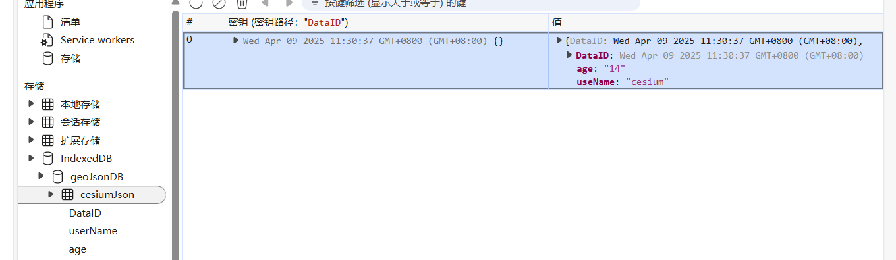

# 创建indexDB数据库

IndexedDB查询不像MySQL等数据库方便，它只能通过主键、索引、游标方式查询数据

```js
/**
 * 打开数据库
 * @param {object} dbName 数据库的名字
 * @param {string} storeName 仓库名称
 * @param {string} version 数据库的版本号
 * @return {object} 该函数会返回一个数据库实例
 */
function openDB(dbName, version = 1) {
    return new Promise((resolve, reject) => {
        //  兼容浏览器
        var indexedDB =
            window.indexedDB ||
            window.mozIndexedDB ||
            window.webkitIndexedDB ||
            window.msIndexedDB;
        let db;
        // 打开数据库，若没有则会创建
        const request = indexedDB.open(dbName, version);
        // 数据库打开成功回调
        request.onsuccess = function (event) {
            db = event.target.result; // 数据库对象
            console.log("数据库打开成功");
            resolve(db);
        };

        // 数据库打开失败的回调
        request.onerror = function (event) {
            console.log("数据库打开报错");
        };
        // 数据库有更新时候的回调,其实可以理解为在这里创建表或数据库
        //将表的一个字段修改或者 更新表中的数据都不会产生数据库的更新
        //创建表、创建存储库这种数据库层面时才会触发这个函数
        request.onupgradeneeded = function (event) {
            // 版本号更新、数据库创建或升级的时候会触发
            console.log("onupgradeneeded");
            db = event.target.result; // 数据库对象
            var objectStore;
            // 创建存储库，signalChat这里为自定义的存储库/表名称
            objectStore = db.createObjectStore("signalChat", {
                keyPath: "sequenceId", // 这是主键
                // autoIncrement: true // 实现自增
            });
            // 创建索引，在后面查询数据的时候可以根据索引查，这里需要注意，设置了不唯一，如果主键相同了 会导致写入失败
            objectStore.createIndex("DataID", "DataID", { unique: true });
            objectStore.createIndex("userName", "userName", { unique: false });
            objectStore.createIndex("age", "age", { unique: false });
        };
    });
}

```

# 插入数据

```js
/**
 * 新增数据
 * @param {object} db 数据库实例
 * @param {string} storeName 仓库名称
 * @param {string} data 数据
 */
function addData(db, storeName, data) {
    var request = db
    .transaction([storeName], "readwrite") // 事务对象 指定表格名称和操作模式（"只读"或"读写"）
    .objectStore(storeName) // 仓库对象
    .add(data);

    request.onsuccess = function (event) {
        console.log("数据写入成功");
    };

    request.onerror = function (event) {
        console.log("数据写入失败");
    };
}


let db=await  openDB('geoJsonDB',1)
let data={
    DataID:new Date().getTime(),
    useName:'cesium',
    age:'14'
}
addData(db,'cesiumJson',data)
console.log(db);
```



# 主键读取数据

```js
/**
 * 通过主键读取数据
 * @param {object} db 数据库实例
 * @param {string} storeName 仓库名称
 * @param {string} key 主键值
 */
function getDataByKey(db, storeName, key) {
  return new Promise((resolve, reject) => {
    var transaction = db.transaction([storeName]); // 事务
    var objectStore = transaction.objectStore(storeName); // 仓库对象
    var request = objectStore.get(key); // 通过主键获取数据

    request.onerror = function (event) {
      console.log("事务失败");
    };

    request.onsuccess = function (event) {
      console.log("主键查询结果: ", request.result);
      resolve(request.result);
    };
  });
} 

```

# 游标读取数据

```js
/**
 * 通过游标读取数据
 * @param {object} db 数据库实例
 * @param {string} storeName 仓库名称
 */
function cursorGetData(db, storeName) {
    let list = [];
    var store = db
    .transaction(storeName, "readwrite") // 事务
    .objectStore(storeName); // 仓库对象
    var request = store.openCursor(); // 指针对象
    // 游标开启成功，逐行读数据
    request.onsuccess = function (e) {
        var cursor = e.target.result;
        //判断指针是否已经读到了最后一个数据
        if (cursor) { 
            // 必须要检查
            list.push(cursor.value);
            cursor.continue(); // 指针继续向后移动，遍历了存储对象中的所有内容
        } else {
            console.log("游标读取的数据：", list);
        }
    };
}


```

# 通过字段/索引读取数据

通过字段的指 查询数据，只会返回第一条符合条件的数据

```js
/**
 * 通过索引读取数据
 * @param {object} db 数据库实例
 * @param {string} storeName 仓库名称
 * @param {string} indexName 索引名称
 * @param {string} indexValue 索引值
 */
function getDataByIndex(db, storeName, indexName, indexValue) {
    var store = db.transaction(storeName, "readwrite").objectStore(storeName);
    var request = store.index(indexName).get(indexValue);
    request.onerror = function () {
        console.log("事务失败");
    };
    request.onsuccess = function (e) {
        var result = e.target.result;
        console.log("索引查询结果：", result);
    };
}

```

# 通过索引和游标查询数据

```js
/**
 * 通过索引和游标查询记录
 * @param {object} db 数据库实例
 * @param {string} storeName 仓库名称
 * @param {string} indexName 索引名称
 * @param {string} indexValue 索引值
 */
function cursorGetDataByIndex(db, storeName, indexName, indexValue) {
    let list = [];
    var store = db.transaction(storeName, "readwrite").objectStore(storeName); // 仓库对象
    var request = store
    .index(indexName) // 索引对象
    .openCursor(IDBKeyRange.only(indexValue)); // 指针对象
    request.onsuccess = function (e) {
        var cursor = e.target.result;
        if (cursor) {
            // 必须要检查
            list.push(cursor.value);
            cursor.continue(); // 遍历了存储对象中的所有内容
        } else {
            console.log("游标索引查询结果：", list);
        }
    };
    request.onerror = function (e) {};
}

```

# 通过索引和游标分页查询

```js
/**
 * 通过索引和游标分页查询记录
 * @param {object} db 数据库实例
 * @param {string} storeName 仓库名称
 * @param {string} indexName 索引名称
 * @param {string} indexValue 索引值
 * @param {number} page 页码
 * @param {number} pageSize 查询条数
 */
function cursorGetDataByIndexAndPage(
db,
 storeName,
 indexName,
 indexValue,
 page,
 pageSize
) {
    let list = [];
    let counter = 0; // 计数器
    let advanced = true; // 是否跳过多少条查询
    var store = db.transaction(storeName, "readwrite").objectStore(storeName); // 仓库对象
    var request = store
    .index(indexName) // 索引对象
    .openCursor(IDBKeyRange.only(indexValue)); // 指针对象
    request.onsuccess = function (e) {
        var cursor = e.target.result;
        if (page > 1 && advanced) {
            advanced = false;
            cursor.advance((page - 1) * pageSize); // 跳过多少条
            return;
        }
        if (cursor) {
            // 必须要检查
            list.push(cursor.value);
            counter++;
            if (counter < pageSize) {
                cursor.continue(); // 遍历了存储对象中的所有内容
            } else {
                cursor = null;
                console.log("分页查询结果", list);
            }
        } else {
            console.log("分页查询结果", list);
        }
    };
    request.onerror = function (e) {};
}

```

# 更新/修改数据

IndexedDB更新数据较为简单，直接使用put方法，值得注意的是如果数据库中没有该条数据，则会默认增加该条数据，否则更新

```js
/**
 * 更新数据
 * @param {object} db 数据库实例
 * @param {string} storeName 仓库名称
 * @param {object} data 数据
 */
function updateDB(db, storeName, data) {
  var request = db
    .transaction([storeName], "readwrite") // 事务对象
    .objectStore(storeName) // 仓库对象
    .put(data);

  request.onsuccess = function () {
    console.log("数据更新成功");
  };

  request.onerror = function () {
    console.log("数据更新失败");
  };
}

```

# 通过主键删除数据

```js
/**
 * 通过主键删除数据
 * @param {object} db 数据库实例
 * @param {string} storeName 仓库名称
 * @param {object} id 主键值
 */
function deleteDB(db, storeName, id) {
    var request = db
    .transaction([storeName], "readwrite")
    .objectStore(storeName)
    .delete(id);

    request.onsuccess = function () {
        console.log("数据删除成功");
    };

    request.onerror = function () {
        console.log("数据删除失败");
    };
}
```

# 通过索引和游标删除指定数据

```js
/**
 * 通过索引和游标删除指定的数据
 * @param {object} db 数据库实例
 * @param {string} storeName 仓库名称
 * @param {string} indexName 索引名
 * @param {object} indexValue 索引值
 */
function cursorDelete(db, storeName, indexName, indexValue) {
  var store = db.transaction(storeName, "readwrite").objectStore(storeName);
  var request = store
    .index(indexName) // 索引对象
    .openCursor(IDBKeyRange.only(indexValue)); // 指针对象
  request.onsuccess = function (e) {
    var cursor = e.target.result;
    var deleteRequest;
    if (cursor) {
      deleteRequest = cursor.delete(); // 请求删除当前项
      deleteRequest.onerror = function () {
        console.log("游标删除该记录失败");
      };
      deleteRequest.onsuccess = function () {
        console.log("游标删除该记录成功");
      };
      cursor.continue();
    }
  };
  request.onerror = function (e) {};
}
```

# 关闭/删除数据库

```js
/**
 * 关闭数据库
 * @param {object} db 数据库实例
 */
function closeDB(db) {
  db.close();
  console.log("数据库已关闭");
}


/**
 * 删除数据库
 * @param {object} dbName 数据库名称
 */
function deleteDBAll(dbName) {
  console.log(dbName);
  let deleteRequest = window.indexedDB.deleteDatabase(dbName);
  deleteRequest.onerror = function (event) {
    console.log("删除失败");
  };
  deleteRequest.onsuccess = function (event) {
    console.log("删除成功");
  };
}

```

# 使用indexDB管理文件上传状态

```js

const chunkSize = 1024 * 1024; // 每个块的大小为 1MB
let uploadManager = {};

// 打开 IndexedDB 数据库
let db;
const request = indexedDB.open('disasterUploadDB', 1);

request.onupgradeneeded = function (event) {
    db = event.target.result;
    const objectStore = db.createObjectStore('uploads', { keyPath: 'disasterId' });
    objectStore.createIndex('filename', 'filename', { unique: false });
};

request.onsuccess = function (event) {
    db = event.target.result;
};

request.onerror = function (event) {
    console.error('IndexedDB 打开失败:', event.target.error);
};

// 选择文件并开始上传
async function startUpload(disasterId, file) {
    const totalChunks = Math.ceil(file.size / chunkSize);
    const chunks = [];
    for (let i = 0; i < totalChunks; i++) {
        const start = i * chunkSize;
        const end = Math.min(start + chunkSize, file.size);
        chunks.push({
            index: i,
            blob: file.slice(start, end),
            uploaded: false
        });
    }


    //在当前传输中初始化各个文件的上传状态，包括文件本身、分块数组和总块数。
    uploadManager[disasterId] = {
        file,
        chunks,
        totalChunks
    };

    // 从 IndexedDB 中恢复上传状态
    await restoreUploadStatus(disasterId);

    // 开始上传
    await uploadChunks(disasterId);
}

// 从 IndexedDB 恢复上传状态
async function restoreUploadStatus(disasterId) {
    return new Promise((resolve, reject) => {
        const transaction = db.transaction(['uploads'], 'readonly');
        const objectStore = transaction.objectStore('uploads');
        const request = objectStore.get(disasterId);
        //读取指定 disasterId 的上传状态。并将初始化的分块数组中的已上传的 uploaded 属性设置为 true。
        request.onsuccess = function (event) {
            const storedData = event.target.result;
            if (storedData) {
                const { uploadedChunks } = storedData;
                uploadManager[disasterId].chunks.forEach(chunk => {
                    if (uploadedChunks.includes(chunk.index)) {
                        chunk.uploaded = true;
                    }
                });
            }
            resolve();
        };

        request.onerror = function (event) {
            console.error('从 IndexedDB 恢复上传状态失败:', event.target.error);
            reject(event.target.error);
        };
    });
}

// 上传块
async function uploadChunks(disasterId) {
    const { file, chunks, totalChunks } = uploadManager[disasterId];
    for (let i = 0; i < chunks.length; i++) {
        const chunk = chunks[i];
        if (!chunk.uploaded) {
            try {
                const formData = new FormData();
                formData.append('chunk', chunk.blob);
                formData.append('index', chunk.index);
                formData.append('totalChunks', totalChunks);
                formData.append('filename', file.name);
                formData.append('disasterId', disasterId);

                const response = await fetch('http://localhost:3000/upload', {
                    method: 'POST',
                    body: formData
                });

                if (response.ok) {
                    chunk.uploaded = true;
                    //更新数据库中的上传状态
                    await saveUploadStatus(disasterId);
                } else {
                    console.error('上传失败:', response.statusText);
                    break;
                }
            } catch (error) {
                console.error('网络错误:', error);
                break;
            }
        }
    }

    // 检查是否所有块都已上传
    if (chunks.every(chunk => chunk.uploaded)) {
        // 合并块
        await fetch('http://localhost:3000/merge', {
            method: 'POST',
            headers: {
                'Content-Type': 'application/json'
            },
            body: JSON.stringify({
                filename: file.name,
                totalChunks,
                disasterId
            })
        });
        // 清除 IndexedDB 中的上传状态
        await clearUploadStatus(disasterId);
        console.log('文件上传完成');
    }
}

// 保存上传状态到 IndexedDB
async function saveUploadStatus(disasterId) {
    return new Promise((resolve, reject) => {
        const { chunks } = uploadManager[disasterId];
        const uploadedChunks = chunks.filter(chunk => chunk.uploaded).map(chunk => chunk.index);
        const transaction = db.transaction(['uploads'], 'readwrite');
        const objectStore = transaction.objectStore('uploads');
        const request = objectStore.put({
            disasterId,
            uploadedChunks
        });

        request.onsuccess = function () {
            resolve();
        };

        request.onerror = function (event) {
            console.error('保存上传状态到 IndexedDB 失败:', event.target.error);
            reject(event.target.error);
        };
    });
}

// 清除 IndexedDB 中的上传状态
async function clearUploadStatus(disasterId) {
    return new Promise((resolve, reject) => {
        const transaction = db.transaction(['uploads'], 'readwrite');
        const objectStore = transaction.objectStore('uploads');
        const request = objectStore.delete(disasterId);

        request.onsuccess = function () {
            resolve();
        };

        request.onerror = function (event) {
            console.error('清除 IndexedDB 中的上传状态失败:', event.target.error);
            reject(event.target.error);
        };
    });
}

// 示例调用
const fileInput = document.getElementById('fileInput');
fileInput.addEventListener('change', async (e) => {
    const file = e.target.files[0];
    const disasterId = 'disaster_123'; // 假设的灾情 ID
    if (file) {
        await startUpload(disasterId, file);
    }
});
```

