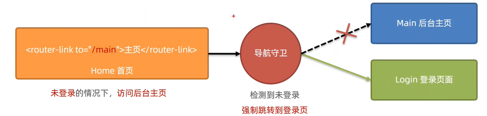

[TOC]

# 一、Webpack

**什么是前端工程化**：

- 在企业级的前端项目开发中，把前端开发所需的**工具、技术、流程、经验等进行规范化、标准化**。

**什么是webpack**：

- webpack是前端项目工程化的具体解决方案。
- 提供了友好的前端模块化开发支持，以及代码压缩混淆、处理浏览器端JavaScript 的兼容性、性能优化等强大的功能。

## 1. Webpack基础

### 1.1 安装与配置webpack

**(1) 在项目中安装webpack包**

在项目终端输入命令安装webpack相关的包

```
npm install webpack webpack-cli
```


**(2) 在项目根目录中创建webpack配置文件webpack.config.js并初始化基本配置**

```js
module.exports={
    mode:'development'  // mode 用来指定构建模式。可选值有development和 production
}
```


**(3) 在package.json的scripts节点下，新增dev脚本**

```json
"scripts":{
    //这个脚本名称是什么都行，如dev,xxx,aa
    "dev":"webpack" //script节点下的脚本，可以通过npm run执行。例如npm run dev
}
```


**(4) 在终端中运行npm run dev命令，启动 webpack进行项目的打包构建**

```
npm run dev
```

之后webpack会自动生成一个 ==dist== 的文件夹 其中 会有对原本项目中代码进行兼容处理后的文件 ==main.js==


**(5) 不再引入项目原代码，而是引入main.js**


### 1.2 mode可选值的应用场景

mode 节点的可选值有两个，分别是:

- development :
  - 开发环境
  - 不会对打包生成的文件进行代码压缩和性能优化
  - 打包速度快，适合在开发阶段使用

- production :
  - 生产环境
  - 会对打包生成的文件进行代码压缩和性能优化
  - 打包速度很慢，仅适合在项目发布阶段使用

总结：

- 开发时候一定要用development，因为追求的是打包的速度,而不是体积;
- 发布上线的时候一定能要用productionl因为上线追求的是体积小，而不是打包速度快!


### 1.3 指定webpack打包的entry(入口)和output(出口)

**(1) npm run dev的执行顺序**

在终端中执行npm run dev命令执行package.json中自定义脚本"scripts":{ "dev":"webpack" }时，**不是直接执行webpack**，而是**先读取项目根目录下名叫webpack.config.js的文件中==向外导出的配置选项==**


**(2) webpack的默认约定**

在webpack 4.x和5.x版本中，有如下默认约定：

- 默认的打包入口文件为==src -> index.js==
- 默认的输出文件路径为==dist -> main.js==

注意：可以在**webpack.config.js**中修改打包的默认约定


**(3) 自定义打包的入口和出口**

在webpack.config.js配置文件中，通过**entry节点指定打包的入口**。通过**output节点指定打包的出口**。

如：

```js
const path=require('path') //导入node.js 中专门操作路径的模块

module.exports={
    entry:path_join(__dirname,'./src/index.js'), //设置打包的入口文件路径
    output:{
        path:path.join(__dirname,'./dist'), // 设置打包的出口文件路径
        filename:'bundle.js' // 设置打包的出口文件名称
    }
}
```


## 2. 插件

通过安装和配置第三方的插件，可以拓展webpack 的能力，从而让webpack 用起来更方便。最常用的webpack插件有如下两个:

- webpack-dev-server
  - 类似于node.js阶段用到的nodemon工具
  - 每当修改了源代码，webpack 会自动进行项目的打包和构建
- html-webpack-plugin
  - webpack 中的 HTML插件（类似于一个模板引擎插件)
  - 可以通过此插件自定制index.html页面的内容

### 2.1 安装与配置webpack-dev-server

**(1) 安装webpack-dev-server**

```
npm i webpack-dev-server -D //属于开发阶段工具
```


**(2) 配置webpack-dev-server**

修改package.json -> scripts 中的dev命令如下:

```json
"scripts":{ 
    "dev":"webpack serve" //script节点下的脚本，可以通过npm run执行
}
```

再次运行 npm run dev 命令，重新进行项目的打包

在浏览器中访问http: //localhost:8080地址，查看自动打包效果

注意：

- webpack-dev-server 会**启动一个实时打包的http服务器**
- 在终端按下ctrl+c停止实时打包


#### 2.1.1 webpack-dev-server原理

启动webpack-dev-server后修改代码，直接打开原本的文件，发现并不会发生变化：

在运行 npm run dev 命令后根据提示可知

- 原因1： 项目运行是在8080端口，而直接打开原文件是协议是file协议，所以想查看最新效果应该是在http://localhost:8080打开文件【打开端口后会显示项目根目录下的文件】
  - **解析**：当打开src文件夹后,会因为浏览器一旦进入src文件夹下就会自动展示该文件夹下的index.html文件，此时会发现代码修改后仍旧不会变化【默认的打包入口文件为src -> index.js,所以项目中在不做修改的情况下应该创建一个src文件夹】

- 原因2：根据提示webpack output is served from /可知webpack生成的js文件在当前根目录下，但是在资源管理器中，无法找到该文件，而在http://localhost:8080后在输入对应的js文件名时发现，这个文件实际上是存在的
  - **解析**：因为webpack-dev-server生成的js文件并没有放到物理磁盘上，而是<span style="color:red">放入内存</span>中【内存读取更快，且防止了频繁读写对磁盘的损害】


==**解决方式**==：

- 方式1：根据以上解析，可知使用该插件后，想要实时的更改页面效果，需要在页面中加载和引用内存中的js文件，虽然看不见，但是可以引用
- 方式2：使用插件**html-webpack-plugin**

### 2.2 安装与配置html-webpack-plugin

**(1) 安装html-webpack-plugin**

```
npm i html-webpack-plugin -D
```


**(2) 配置html-webpack-plugin**

```js
// 1．导入HTML插件，得到一个构造函数
const HtmlPlugin = require('html-webpack-plugin')

// 2．创建HTML 插件的实例对象
const htmlPlugin = new HtmlPlugin({
template: './src/index.html',   //指定原文件的存放路径
filename: './index.html',  //指定生成的文件的存放路径
})

module.exports = {
mode: 'development',
plugins: [htmlPlugin],// 3．通过 plugins 节点，使htmlPlugin 插件生效
}
```


**(3) html-webpack-plugin特性**

- 通过HTML插件复制到项目根目录中的index.html页面，也被放到了内存中
- HTML插件在生成的index.html页面，自动注入了打包的bundle.js 文件


### 2.3 devServe节点

在webpack.config.js 配置文件中，可以通过**devServer**节点对**webpack-dev-serve**r插件进行更多的配置

如：

```js
devServe:{
    open:true,        //初次打包完成后，自动打开浏览器
    host:'127.0.0.1'  //实时打包所使用的主机地址
    port:80           //实时打包所使用的端口号【默认是8080,执行脚本后，端口改为了80】
}
```

注意:

- 凡是修改了webpack.config.js 配置文件，或修改了package.json配置文件，==**必须重启实时打包的服务器**==，否则最新的配置文件无法生效!


## 3. loader

### 3.1 loader的概述

**(1) 作用**

在实际开发过程中，webpack**默认只能打包处理以.js后缀名结尾的模块**。**其他非.js后缀名结尾的模块，webpack默认处理不了**，需要调用==loader 加载器才==可以正常打包，否则会报错!

loader加载器的作用:==协助webpack打包处理特定的文件模块==。比如:

- css-loader可以打包处理.css相关的文件
- less-loader 可以打包处理.less相关的文件
- babel-loader 可以打包处理webpack 无法处理的高级JS语法


### 3.2 loader的调用过程


如：

1. webpack默认只能打包处理.js 结尾的文件，处理不了其它后缀的文件
2. 由于代码中包含了index.css 这个文件,因此 webpack 默认处理不了
3. 当webpack'发现某个文件处理不了的时候，会查找webpack.config.js 这个配置文件，看module.rules数组中，是否配置了对应的loader 加载器。
4. webpack 把index.css这个文件，先转交给最后一个loader进行处理（先转交给css-loader) .
5. 当css-loader处理完毕之后，会把处理的结果，转交给下一个loader(转交给style-loader)
6. 当style-loader处理完毕之后，发现没有下一个loader了，于是就把处理的结果，转交给了webpack
7. webpack把 style-loader处理的结果，合并到/dist/bundle.js【不做设置的话默认是main.js】 中，最终生成打包好的文件。


### 3.3 打包处理CSS文件

**(1) 安装 style-loader 与 css-loader插件**

```
npm i style-loader css-loader -D
```


(2) **在webpack.config.js的module->rules数组中，添加loader规则，如下**

```js
module:{ //所有第三方文件模块的匹配规则
    rules:[  //文件后缀名的匹配规则
        {test:/\.css$/,use:['style-loader','css-loader']}//意为 遇到以.css结尾的文件，就使用 'css-loader' 'style-loader'来处理
    ]
}
```

==test==表示匹配的**文件类型**，==use==表示对应**要调用的loader**

注意 :

- use数组中指定的loader 顺序是固定的
- 多个loader的调用顺序是:<span style="color:red">从后往前调用</span>


### 3.4 打包处理less文件

**(1) 安装less-loader 和 less 插件**

```
npm i less-loader less -D
```

其中less包只是一个依赖项，less-loader工作需要使用到less包，因此在下方不需要配置less


 (2) **在webpack.config.js的module->rules数组中，添加loader规则，如下**

```JS
module:{ //所有第三方文件模块的匹配规则
    rules:[  //文件后缀名的匹配规则
        {test:/\.less$/,use:['style-loader','css-loader','less-loader']}//意为 遇到以.less结尾的文件，就使用'less-loader' 'css-loader' 'style-loader'来处理
    ]
}
```


### 3.5 打包处理样式表中与URL路径相关的文件

**(1) 安装url-loader 和 file-loader 插件**

```
npm i url-loader file-loader
```


(2) **在webpack.config.js的module->rules数组中，添加loader规则，如下**

```js
module:{ //所有第三方文件模块的匹配规则
    rules:[  //文件后缀名的匹配规则
        {test:/\.jpg|png|gif$/,use:'url-loader?limit=22229'}//意为 遇到以.jpg|png|gif结尾的文件，就使用'url-loader'来处理
    ]
}
```

其中 ? 之后的是 loader的参数项 :

- limit用来指定图片的大小，单位是字节( byte)
- 只有 ≤ limit大小的图片，才会被转为base64格式的图片

==补充==：

- 使用如< img src=./sss>形式获取图片是，当浏览器拿到标签时，仅仅是拿到了标签，并没有获取到标签中引用的图片，因此浏览器想要展示这些图片，必须再发一次请求来获取图片，才能顺利展示
- 如果是使用base64的形式来引用图，当浏览器拿到标签时，就会将图片一同请求下来，减少了不必要的请求，但**缺点是图片使用base64时，会使图片体积比原本的大一些，因此适合小图片**


### 3.6 打包处理js文件中的高级语法

webpack只能打包处理一部分高级的JavaScript语法。对于那些webpack无法处理的高级js 语法【如：装饰器】，需要借助于**==babel-loader==**进行打包处理。

**(1) 安装babel-loader 和 @babel/core 和 @babel/plugin-proposal-decorators包**

```
npm i babel-loader @babel/core @babel/plugin-proposal-decorators -D
```


(2) **在webpack.config.js的module->rules数组中，添加loader规则，如下**

```js
module:{ 
    rules:[  
      // 注意:必须使用exclude指定排除项。因为node_modules目录下的第三方包不需要被打包
        {test:/\.js$/,use:'babel-loader',exclude:'/node_modules/'}
    ]
}
```

注意：

- 在配置 babel-loader的时候，只需要把自己的代码进行转换即可;一定要排除 node_modules目录中的JS文件
- 因为第三方包中的JS 兼容性,不需要程序员关心


**(3) 配置babel-loader**

<span style="color:red">在项目根目录下</span>:创建名为**babel.config.js** 的配置文件，定义Babel的配置项如下:

```js
module.exports={
    //声明babel可用插件
    // 将来,webpack在调用babel-loader的时候，会先加载 plugins插件来使用
    plugins:[['@babel/plugin-proposal-decorators',{legacy:true}]]
}
```


### 3.7 Webpack处理样式的过程

在入口函数中使用import './xxx/xx.css' 形式导入样式时，表示将对应样式加载过来，而不需要使用import a from'./xxx/xx.css' 来对其进行接收【若打印a会显示undefind,因为打印的是接收的结果，没有意义】，而又因为webpack会对入口函数进行处理，生成main.js函数，而此时入口函数又已经加载了样式了，所以只需要在页面中引入main.js文件，即相当于也引入了对应样式

即：**如果某个模块中，使用from 接收到的成员为undefined，则没必要进行接收**


## 4. 打包发布

### 4.1 配置bulid命令

在**package.json**文件的scripts 节点下，新增build命令如下:

```json
"script":{
    "dev":"webpack serve",//开发环境中，运行dev命令
    "build":"webpack --mode production" //项目发布时，运行build命令        
         }

//这里实际上 如果写为
"build":"webpack" //同样可以打包，但是由于没有设置运行模式，会导致代码不会压缩
或
"build":"webpack serve" //这样打包后会在内存中，而不是磁盘上
```

- --model：是一个参数项，用来指定webpack的运行模式。
- production ：代表生产环境，会对打包生成的文件进行代码压缩和性能优化。

**注意**：通过--model指定得参数项，会<span style="color:red">覆盖</span> webpack.config.js 中的model选项。


### 4.2 优化图片和js文件的存放路径

**(1) 把JavaScript文件统一生成到js目录中**

在webpack.config.js 配置文件的output节点中，进行如下的配置：

```js
output:{
   path:path.join(__dirname,'dist'),
//明确告诉 webpack把生成的 bundle.js 文件存放到 dist目录下的js子目录中
   filename:'js/bundle.js'
}
```


**(2) 把图片文件统一生成到image目录中**

修改webpack.config.js 中的url-loader配置项，新增outputPath选项即可指定图片文件的输出路径

```js
module:{ 
    rules:[ 
        {test:/\.jpg|png|gif$/,use:'url-loader?limit=22229&outputPath=images'}
    ]
}

//或者按照以下写法【不推荐】
test:/\.jap|png|gif$/,
    use:{
        loader:'url-loader',
        options:{
            limit:22228,
            //明确指定把打包生成的图片文件，存储到dist目录下的 image文件夹中
            outputPath:'images'
        }
    }
```


### 4.3 配置和使用clean-webpack-plugin插件自动删除dist目录

为了在每次打包发布时自动清理掉dist目录中的旧文件，可以安装并配置clean-webpack-plugin 插件

可在output中配置clean：true即可


## 5. Source Map

**Source Map就是一个信息文件，里面储存着位置信息**。Source Map 文件中存储着压缩混淆后的代码，所对**应的转换前的位置**。

出错的时候，除错工具将直接显示原始代码，而不是转换后的代码，能够极大的方便后期的调试。


**默认Source Map的问题:**

开发环境下默认生成的Source Map,记录的是生成后的代码的位置。会导致运行时报错的行数与源代码的行
数不一致的问题。


### 5.1 解决默认Source Map的问题

开发环境下，推荐在webpack.config.js 中添加如下的配置，即可**保证运行时报错的行数与源代码的行数保持一致**:

```js
module.exports={
    mode:'development',
    //eval-source-map 仅限在"开发模式"下使用，不建议在"生产模式"下使用。
    //此选项生成的Source Map 能够保证""运行时报错的行数""与"源代码的行数"保持一致
    devtool:'eval-source-map',
    ....
}
```


**webpack 生产环境下的Source Map**:

在生产环境下，如果省略了devtool选项，则最终生成的文件中不包含Source Map。这能够防止原始代码通过Source Map 的形式暴露给别有所图之人。


### 5.2 只定位行数不暴露源码

在生产环境下，如果只想定位报错的具体行数，且不想暴露源码。此时可以将devtool的值设置为nosources-source-map。

采用此选项后:应该<span style="color:red">将服务器配置为，不允许普通用户访问source map文件</span>!


### 5.3 不同环境下的devtool配置;

- 开发环境下:
  - 建议把 devtool 的值设置为 eval-source-map 
  - 好处:可以精准定位到具体的错误行
- 生产环境下:
  - 建议关闭 Source Map 或将 devtool的值设置为 nosources-source-map
  - 好处:防止源码泄露，提高网站的安全性


## 6. 拓展

### 6.1 webpack中@的原理

在 **webpack.config.js**中module.exports中配置,==使@符号表示为指定目录==。

```js
resolve:{
    alias:{
        '@':path.join(__dirname:'./src/')
    }
}
```

### 6.2 vscode @路径提示插件

插件：path Autocomplete

在settings.json中的配置代码：【直接粘贴在大括号中即可】

```json
//导入文件时是否携带文件的扩展名
"path-autocomplete.extensionOnImport": true,
//配置@的路径提示
"path-autocomplete.pathMappings": {
    "@": "${folder}/src"
 }

```


# 二、vue简介

- **什么是vue**：
  - Vue：是一套用于构建用户界面的前端框架。
- **构建用户界面**：
  - 用vue往html页面中填充数据,非常的方便
- **框架**：
  - 框架是一套现成的解决方案，程序员只能遵守框架的规范，去编写自己的业务功能!

- **vue的特性**：
  - 数据驱动视图
  - 双向数据绑定

## 1. 数据驱动视图

在使用了vue的页面中，vue 会监听数据的变化，从而自动重新渲染页面的结构。示意图如下:


**好处**: 当页面数据发生变化时，页面会自动重新渲染!

注意: 数据驱动视图是<span style="color:red">单向的数据绑定</span>。


## 2. 双向数据绑定

在填写表单时，双向数据绑定可以辅助开发者在不操作DOM的前提下，自动把用户填写的内容同步到数据源中。示意图如下:


开发者不再需要手动操作DOM元素，来获取表单元素最新的值:

- js数据的变化，会被自动渲染到页面上
- 页面上表单采集的数据发生变化的时候，会被vue自动获取到，并更新到js数据中


## 3. MVVM

MVVM是vue实现数据驱动视图和双向数据绑定的核心原理。MVVM指的是Model、View和ViewModel,它把每个HTML页面都拆分成了这三个部分，如图所示:


在MVVM概念中:

- **Model** : 表示当前页面渲染时所依赖的数据源。
- **View** : 表示当前页面所渲染的DOM结构。
- **ViewModel** : 表示 vue的实例，它是 MVVM的核心。


**MVVM工作原理：**

ViewModel作为MVVM的核心，是它把当前页面的数据源（Model)和页面的结构（View）连接在了一起。

工作原理如图：


当**数据源发生变化时**，会被ViewModel监听到，VM会根据最新的数据源**自动更新页面的结构**

当**表单元素的值发生变化时**，也会被VM监听到，VM会把变化过后最新的值**自动同步到Model数据源中**


## 4. vue基本使用

### 4.1 基本步骤

1. 导入vue.js 的script脚本文件
2. 在页面中声明一个将要被vue所控制的DOM区域
3. 创建vm实例对象(vue 实例对象)

如：

```html
<body>
<!-- 2．在页面中声明一个将要被vue所控制的DOM区域,一般推荐就为这个控制范围起id为app-->
    <!-- 如果因为选择器指定了多个范围，则vue只控制第一个-->
    <div id="app">{{username}}</div>
<!-- 1．导入vue.js 的script脚本文件-->
    <script src="./lib/vue.js"></script>
    <script>
        //3．创建vm实例对象(vue实例对象)
        const vm = new Vue({
            // el 属性是固定的写法，表示当前vm实例要控制页面上的哪个区域，接收的值是一个选择器
            el: '#app',
            //  指定Model数据源，data 对象就是要合染到页而上的数据
            data: {
            username: 'zs'
            }
        })
   </script>
</body>

```

其中 **基本代码与mvvm的关系**：


# 三、vue的指令和过滤器

**指令的概念**：

指令(Directives)是vue 为开发者提供的模板语法，用于辅助开发者渲染页面的基本结构。

vue中的指令在使用时都必须以 ==**v-**==开头


**vue 中的指令按照不同的用途可以分为如下6大类**:

- 内容渲染指令
- 属性绑定指令
- 事件绑定指令
- 双向绑定指令
- 条件渲染指令
- 列表渲染指令

## 1. 内容渲染指令

内容渲染指令**用来辅助开发者渲染DOM元素的文本内容**。常用的内容渲染指令有如下3个:

- v-text
- {{}}
- v-html

### 1.1 v-text

```html
<!--把username对应的值，渲染到第一个p标签中 -->
<p v-text="username"></p>

<!---把 gender 对应的值，渲染到第二个p标签中 -->
<!--注意:第二个p标签中，默认的文本“性别”会被gender的值覆盖掉-->
<p v-text="gender">性别</p>
```

注意 : **v-text指令会覆盖元素内默认的值。**


### 1.2 {{}}

vue提供的{{}}语法，专门用来解决v-text 会覆盖默认文本内容的问题。这种{{}}语法的专业名称是**插值表达式**  （英文名为:Mustache)。

插值表达式 : **在实际开发中用的最多，只是内容的占位符，不会覆盖原有的内容**!

注意： <span style="color:red"> 插值表达式不能放在属性节点【不能作为属性或属性的值】，只能放在内容节点</span>.

### 1.3 v-html

v-text 指令和插值表达式只能渲染纯文本内容。如果<span style="color:red">要把**包含HTML标签的字符串**渲染为页面的HTML元素,
则需要用到**v-html**这个指令</span>:

```html
<div id="app">
<p v-html="discription"></p>
</div>
   <script src="./lib/vue.js"></script>
    <script>
        //3．创建vm实例对象(vue实例对象)
        const vm = new Vue({
            el: '#app',
            data: {
            discription:'<h4 style="color: red;font-weight: bold;">欢迎大家来学习vue.js</h4>'
            }
        })
   </script>
```


## 2. 属性绑定指令 v-bind | :

**vue 规定v-bind:指令可以简写为 ==:==**

如果需要为元素的属性动态绑定属性值，则需要用到v-bind属性绑定指令。用法示例如下:

```js
<div id="app">
<input type="text" v-bind:placeholder="tips">
</div>
   <script src="./lib/vue.js"></script>
    <script>
        //3．创建vm实例对象(vue实例对象)
        const vm = new Vue({
            el: '#app',
            data: {
            tips:'输入'
            }
        })
   </script>
```


### 2.1 在插值和属性绑定中编写js

在vue提供的模板渲染语法中，除了支持绑定简单的数据值之外，还**支持Javascript表达式的运算**，例如:

```js
{{number+1}}
{{ok?'yes':'no'}}
{{meassage.split('').reverse().join('')}}
<div :id="'list-' + id"></div>
//因此如果加上:对属性进行绑定，如:id="10",因为是js表达式，所以这里不是在 字符串10 ，而是数字9，若还想赋字符串10的话，需要写为:id="'10'"
```


## 3. 事件绑定指令 v-on: | @

<span style="color:red">v-on：可以简写为 **@**</span>

### v-on的基本使用

vue提供了v-on事件绑定指令，用来辅助程序员为DOM元素绑定事件监听。语法格式如下:

```html
    <div id="app">
        <h3>count的值为: {{count}}</h3>
        <!--语法格式为 v-on:事件名称="事件处理函数的名称"-->
        <button v-on:click="addCount">+1</button>
        </div>
          <script src="./lib/vue.js"></script>
            <script>
                //3．创建vm实例对象(vue实例对象)
                const vm = new Vue({
                    el: '#app',
                    data: {
                    count:0
                    },
                    //methods的作用是：定义事件的处理函数
                    methods:{
                    // addCount:function(){}
                     //以es6语法可以简写：
                     addCount(){
                        console.log(vm);//打印vm会打印Vue构造函数类型的对象,其中就包含了count属性
                        //又因为这里this指向vm，所以可以使用this替代
                        this.count+=1;               
                     }
                     }
                })
           </script>
```


### 绑定事件并传参

在methods中定义函数时同样可以定义参数，并且可以以 **v-on:事件名称="事件处理函数的名称(传入的参数)"**的形式传入参数，如：

```html
  <div id="app">
        <h3>count的值为: {{count}}</h3>
        <button v-on:click="addCount(n)">+1</button>
        </div>
          <script src="./lib/vue.js"></script>
            <script>
                const vm = new Vue({
                    el: '#app',
                    data: {
                    count:0
                    },
                    methods:{    
                     addCount(n){    
                        this.count+=n;               
                     }
                     }
                })
           </script>
```

注意：原生DOM对象有onclick、oninput、onkeyup等原生事件，替换为vue 的事件绑定形式后

分别为: <span style="color:red">v-on:click、 v-on:input、v-on:keyup</span>.

可简写为 ：<span style="color:red">@click、@input、@keyup</span>.


### 事件对象$event

```html
    <div id="app">
        <h3>count的值为: {{count}}</h3>
        <!-- <button @click="addCount">+1</button> -->
        <button @click="addCount(1,$event)">+1</button>
        </div>
          <script src="./lib/vue.js"></script>
            <script>
                const vm = new Vue({
                    el: '#app',
                    data: {
                    count:0
                    },   
                    methods:{    
                    //  addCount(e){
                    //     this.count+=1; 
                    //     如果不传入参数，则方法默认接受到事件对象
                    //     这个事件对象中有属性target，指向事件源(即触发事件的对象)
                    //     console.log(e); 
                    //     if(this.count%2==0){
                    //       e.target.style.backgroundColor='red'
                    //     }else {
                    //         e.target.style.backgroundColor='skyblue'
                    //     } 
                    //  }
                     addCount(n,e){
                        this.count+=n; 
                        //为了解决有时即需要传入参数，又需要使用原生DOM事件对象
                        //vue内置了内置变量 $event
                        if(this.count%2==0){
                          e.target.style.backgroundColor='red'
                        }else {
                            e.target.style.backgroundColor='skyblue'
                        } 
                     }
                     }
                })
           </script>
```


### 事件修饰符

在事件处理函数中调用 **event.preventDefault()** 或 **event.stopPropagation()**是非常常见的需求。vue提供了事件修饰符的概念，来辅助程序员对事件的触发进行控制。常用的5个事件修饰符如下:

| 事件修饰符 | 说明                                                 |
| ---------- | ---------------------------------------------------- |
| .prevent   | 阻止默认行为(例如:阻止a连接的跳转、阻止表单的提交等) |
| .stop      | 阻止事件冒泡                                         |
| .capture   | 以捕获模式触发当前的事件处理函数                     |
| .once      | 绑定的事件只触发1次                                  |
| .self      | 只有在event.target是当前元素自身时触发事件处理函数   |

例子：

```html
<a href="http://www.hao123.com" @click.prevent="show">跳转网页</a>
```


### 按键修饰符

在监听键盘事件时，经常需要判断详细的按键。可以**为键盘相关的事件添加按键修饰符**，例如:

```html
<!--只有在`key`是`Enter`时调用` vm.submit()` -->
<input @keyup.enter="submit">

<!--只有在`key`是`Esc`时调用`  vm.clearInput()`-->
<input @keyup.esc="clear Input">

```


## 4. 双向绑定指令 v-model

vue提供了**v-model**双向数据绑定指令，用来辅助开发者在<span style="color:red">不操作DOM的前提下</span>，**快速获取表单的数据**.

注意：<span style="color:red">v-model不能与普通元素使用，只能与表单元素使用, 或者说有value属性的标签可以使用</span>，如：

- input输入框
  - type="radio"
  - type="checkbox"
  - type="xxxx"
-  textarea
- select

### 4.1 v-model指令的修饰符

为了方便对用户输入的内容进行处理，vue为v-model指令提供了3个修饰符，分别是:

| 修饰符  | 作用                           | 示例                            |
| ------- | ------------------------------ | ------------------------------- |
| .number | 自动将用户的输入值转为数值类型 | < input v-model.number="age" /> |
| .trim   | 自动过滤用户输入的首尾空白字符 | < input v-model.trim="msg"/>    |
| .lazy   | 在“change”时而非“input”时更新  | < input v-model.lazy="msg"/>    |

示例：

```html
<input type="text" v-model.number='n1'>+
<input type="text" v-model.number='n2'>=
<span>{{n1+n2}}</span>
```


## 5. 条件渲染指令 v-if | v-show

### 5.1 v-if 与 v-show的区别

条件渲染指令用来辅助开发者按需**控制DOM的显示与隐藏**。条件渲染指令有如下两个，分别是;

- v-if
- v-show

```html
<body>
  <div id="app">
    <!-- v-if 是动态的创建或删除元素来控制标签的显示与隐藏 -->
    <!-- 如果刚进入页面的时候，某些元素默认不需要被展示，而且后期这个元素很可能也不需要被展示出来，此时v-if性能更好 -->  更推荐v-if

    <p v-if="falg">被v-if控制</p>

   <!-- v-show是通过添加style="display:none"来控制标签的显示与隐藏，适合用于频繁的显示与删除元素 -->
    <p v-show="falg">被v-show控制</p>

  </div>
  <script src="./lib/vue.js"></script>
  <script>
    const vm = new Vue({
      el: '#app',
      data: {
        falg: true
      }
    })
  </script>
</body>
```


### 5.2 v-else |v-else-if

注意: v-else-if 指令必须配合v-if 指令一起使用，否则它将不会被识别!

```html
<body>
  <div id="app">
    <div v-if="type === 'A'">优秀</div>
    <div v-else-if="type === 'B'">良好</div>
    <div v-else-if="type === 'C'">一般</div>
    <div v-else>差</div>

  </div>
  <script src="./lib/vue.js"></script>
  <script>
    const vm = new Vue({
      el: '#app',
      data: {
        type: 'B'
      }
    })
  </script>
</body>
```


## 6. 列表渲染指令 v-for

### 6.1 v-for的 基本使用

vue提供了**v-for**列表渲染指令，用来辅助开发者**基于一个数组来循环渲染一个列表结构**。v-for指令需要使用 ==item in items== 形式的特殊语法，其中:

- items是**待循环的数组**
- item是被**循环的每一项**

例子：

```html
<body>
  <div id="app">
    <ul>
      <li v-for="item in list">姓名是：{{item.name}}</li>
    </ul>
  </div>
  <script src="./lib/vue.js"></script>
  <script>
    const vm = new Vue({
      el: '#app',
      data: {
        list: [
          { id: 1, name: 'zs' },
          { id: 2, name: 'ls' }
        ]
      }
    })
  </script>
</body>
```


### 6.2 v-for的索引

v-for指令还支持一个可选的第二个参数，即当前项的索引。语法格式为**(item, index) in items**，示例代码如下;

```html
<div id="app">
    <ul>
      <li v-for="(item,index) in list">索引是：{{index}}  姓名是：{{item.name}}</li>
    </ul>
  </div>
```


### 6.3 v-for中key值的注意点

官方建议: 

- key 的值必须具有唯一性，尽量**把 id 作为key的值**（即: key的值不能重复)
- 使用index的值当作 key的值没有任何意义(因为index的值不具有唯一性)

- 只要用到了v-for 指令，那么**一定要绑定一个 :key 属性** （既提升性能、又防止列表状态紊乱)
- key的值类型,是有要求的:==**字符串或数字类型**==.

```html
 <div id="app">
    <ul>
      <!-- 官方建议:只要用到了v-for 指令，那么一定要绑定一个:key 属性 -->
      <!-- 而且，尽量把id 作为key的值 -->
      <li v-for="(item,index) in list" :key="item.id">索引是：{{index}} 姓名是：{{item.name}}</li>
    </ul>
  </div>
```


## 7. 过滤器(filters)[vue3不能使用]

### 7.1 过滤器的声明及基本用法

过滤器（Filters）是vue为开发者提供的功能，常用于==文本的格式化==。

过滤器可以用在两个地方: **插值表达式**和 **v-bind 属性绑定**。

过滤器应该被添加在JavaScript表达式的**尾部**，由 “ **管道符** ”进行调用，示例代码如下:

```html
<!--在双花括号中通过管道符"调用capitalize过滤器，对 message的值进行格式化-->
<p>{{ message | capitalize }} </p>   // 加了 | 表示要调用过滤器函数，即调用capitalize函数，并渲染该函数返回的值

<!--在v-bind中通过"管道符""调用formatId过滤器，对rawId 的值进行格式化 -->
<div v-bind:id="rawId |formatId"></div>

```


**过滤器的声明**：

```html
  <div id="app">
    <p>x的值是：{{x | fun}}</p>
  </div>
  <script src="./lib/vue.js"></script>
  <script>
    const vm = new Vue({
      el: '#app',
      data: {
        x: 'guoguo'
      },
      // 过滤器函数，必须被定义到 filters节点之下
      filters: {
        // 过滤器中必须有返回值
        fun(x) {
          //字符串有 charAt方法，这个方法接收索引值，表示从字符串中把索引对应的字符，获取出来
          const first = x.charAt(0).toUpperCase()
          //字符串的slice方法，可以截取字符串，从指定索引往后截取
          const other = x.slice(1)
          return first + other;
        }
      }
    })
  </script>
```


### 7.2 私有过滤器和全局过滤器

**在==filters 节点下定义==的过滤器，称为“私有过滤器”**，因为它**只能在当前vm 实例所控制的el区域内使用**。如果希望在**多个vue实例之间共享过滤器**，则可以按照如下的格式定义全局过滤器:

```html
<!-- 全局过滤器–独立于每个vm实例之外 -->
<!-- Vue.filter()方法接收两个参数 -->
<!-- 第1个参数，是全局过滤器的"名字” -->
<!-- 第2个参数，是全局过滤器的"处理函数”,接收的实参为管道符之前的数据 -->
  <div id="app">
    <p>x的值是：{{x | fun}}</p>
  </div>
  <script src="./lib/vue.js"></script>
  <script>
    //全局过滤器必须写在上方
    Vue.filter('fun',(str)=>{
      return str.charAt(0).toUpperCase() + str.slice(1) +'--'
    })
    const vm = new Vue({
      el: '#app',
      data: {
        x: 'guoguo'
      },
    })
  </script>
```

注意：

- 如果全局过滤器和私有过滤器名字一致，此时按照"就近原则”，调用的是"私有过滤器”


### 7.3 连续调用多个过滤器

```html
<!--把 message的值，交给 filterA进行处理-->
<!--把 filterA处理的结果，再交给filterB进行处理-->
<!--最终把filterB 处理的结果，作为最终的值渲染到页面上-->
{{ message | filterA | filterB }}
```


### 7.4 过滤器传参

```html
<! -- arg1和arg2是传递给filterA的参数-->
<p>{{ message / filterA(arg1, arg2)}}</p>
<script>
    //过滤器处理函数的形参列表中:
    //第一个参数:永远都是"管道符"前面待处理的值
    //从第二个参数开始，才是调用过滤器时传递过来的arg1和arg2参数
  Vue.filter( 'filterA', (msg, arg1, arg2) =>{
     //过滤器的代码逻辑...
})
</script>


```


# 四、Vue基础

## 1. watch侦听器

watch侦听器允许**开发者监视数据的变化**，从而针对数据的变化做特定的操作。

【侦听器同样可以侦听prop】

格式如下：

```js
  <div id="app">
    <!-- 侦听器本质上是一个函数，要监视哪个数据的变化，就把数据名作为方法名即可 -->
    <input type="text" v-model="username">
  </div>
  <script src="./lib/vue.js"></script>
  <script src="../jquery.js"></script>
  <script>

    const vm = new Vue({
      el: '#app',
      data: {
        username: ''
      },
      // 所有的侦听器，都应该被定义到watch节点下
      watch: {
        //监听username值的变化
        //newWal是"变化后的新值”，oldval 是"变化之前的旧值"
        username(newVal, oldVal) {
          if (newVal == '') return;
          $.get('https://www.escook.cn/api/finduser/' + newVal, result => {
            console.log(result);
          })
        }
      }
    })
  </script>
```


### 1.1 侦听器的格式区别

- 方法格式的侦听器【无特殊需求，还是使用方法格式】
  - 缺点1 : 无法在刚进入页面的时候，自动触发
  - 缺点2 : 如果侦听的是一个对象，如果对象中的属性发生了变化，不会触发侦听器
  
- 对象格式的侦听器
  - 好处1 :  可以通过**immediate**选项，让侦听器自动触发!
  - 好处2 : 可以通过**deep**选项，让侦听器深度监听对象中每个属性的变化


### 1.2 immediate选项

```html
  <div id="app">
    <input type="text" v-model="username">
  </div>
  <script src="./lib/vue.js"></script>
  <script src="../jquery.js"></script>
  <script>
    const vm = new Vue({
      el: '#app',
      data: {
        username: 'admin'
      },
      watch: {
        username: {
          //handler就是侦听器函数，--必须叫handler
          handler(newVal, oldVal) {
            if (newVal == '') return;
            $.get('https://www.escook.cn/api/finduser/' + newVal, result => {
              console.log(result);
            })
          },
          // immediate 选项的默认值是false
          // immediate的作用是:控制侦听器是否自动触发一次!
          immediate: true
        }
      }
    })
  </script>
```


### 1.3 deep选项【深度侦听】

**监听所有对象属性：**

```html
 <div id="app">
    <input type="text" v-model="info.username">
  </div>
  <script src="./lib/vue.js"></script>
  <script>
    const vm = new Vue({
      el: '#app',
      data: {
        info: {
          username: 'admin'
        }
      },
      watch: {
        info: {
          //handler就是侦听器函数，--必须叫handler
          handler(newVal, oldVal) {
            console.log(newVal);
          },
          //开启深度监听，只要对象中任何一个属性变化了，都会触发”对象的侦听器“
          deep: true
        }
      }
    })
  </script>
```


**监听对象中的指定属性：**

```js
    //  如果要侦听的是对象的子属性的变化，则必须包裹一层单引号
      watch: {
        'info.username': {
          //handler就是侦听器函数，--必须叫handler
          handler(newVal, oldVal) {
            console.log(newVal);
          },
          //开启深度监听，只要对象中任何一个属性变化了，都会触发”对象的侦听器“
          deep: true
        }
      }
```


## 2. 计算属性-computed

计算属性指的是通过一系列运算之后，最终得到一个属性值。

==计算属性的特点：只要被依赖的数据发生了变化，就会自动求值==。

这个动态计算出来的属性值可以被 **模板结构** 或 **methods** 方法使用。示例代码如下:

```html
<div id="app" >
    <input type="text" v-model="r">
    <input type="text" v-model="g">
    <input type="text" v-model="b">
    <div class="box" :style="{backgroundColor:rgb}"></div>
    <button @click="show">按钮</button>
  </div>
  <script src="./lib/vue.js"></script>
  <script>
    const vm = new Vue({
      el: '#app',
      data: {
       r:0,
       g:0,
       b:0
      },
      //所有的计算属性，都要定义到computed节点之下
      //计算属性在定义的时候，要定义成“方法格式”
      computed:{
        rgb(){
          return `rgb(${this.r},${this.g},${this.b})`
        }
      },
      methods:{
        show(){
          console.log(this.rgb);
        }
      }
    })
  </script>
```

若不使用计算属性 则如下代码在试图修改增加修改透明度功能时会比较麻烦【要修改所有的rgb为rgba】，即代码复用性较高

```html
<div id="app" >
    <input type="text" v-model="r">
    <input type="text" v-model="g">
    <input type="text" v-model="b">
    <!-- : style代表动态绑定一个样式对象，它的值是一个{}样式对象 -->
    <div class="box" :style="{backgroundColor:`rgb(${r},${g},${b})`}"></div>
    <button @click="show">按钮</button>
  </div>
  <script src="./lib/vue.js"></script>
  <script>
    const vm = new Vue({
      el: '#app',
      data: {
       r:0,
       g:0,
       b:0
      },
      methods:{
        show(){
          console.log(this.r,this.g,this.b);
        }
      }
    })
  </script>
```

## 3. axios

```
npm i axios
```

axios是一个专注于网络请求的库!

### 3.1 axios基础语法

```js
   axios({
      method:'请求类型',
      url:'请求的URL地址',
    }).then((result)=>{
      // .then用来指定请求成功之后的回调函数
      // 形参中的result是请求成功之后的结果
    })
//调用axios方法得到的返回值是Promise对象，因此可以使用.then()方法
```


### 3.2 结合async和await调用axios

如果调用某个方法的返回值是 Promise实例，则前面可以添加await!

await只能用在被async“修饰”的方法中

```js
 async function fun() {
     const result= await axios({
        method: 'POST',
        url: 'http://www.liulongbin.top:3006/api/post',
        data: {
          name: 'zs',
          age: 20
        }
      })
      console.log(result);
    }
   fun();
//如不加await则打印的是promise对象，加上则是打印结果对象
//而又因为等号右边是一个包含了众多属性的对象，而当只需要关心其中的data属性时可以通过解构赋值修改代码为
//为了防止命名混淆可以通过：为data重命名为res
 async function fun() {
     const {data:res}= await axios({
        method: 'POST',
        url: 'http://www.liulongbin.top:3006/api/post',
        data: {
          name: 'zs',
          age: 20
        }
      })
      console.log(res.data);
    }
   fun();
```


### 3.3 基于axios.get和axios.post发起请求

**axios.get():**

```js
axios.get(
'url地址',
{
    params:{}//get参数
}
)

//如：
   async function fun() {
     const {data}= await axios.get(
        'http://www.liulongbin.top:3006/api/getbooks',
        {
          params:{
            id:1
          }
        }
      )
      console.log(data);
    }
   fun();
```


**axios.post:**

```js
   async function fun() {
     const {data}= await axios.post(
        'http://www.liulongbin.top:3006/api/post',
        //post请求体数据直接在对象中写数据即可
        {
         name:'zs',
         age:'女'
        }
      )
      console.log(data);
    }
   fun();
```


### 3.4 把axios挂载到Vue原型上并配置请求根路径[不推荐]

在mian.js中：

```js
//导入axios包
import axios from 'axios'

//全局配置axios的请求根路径,如'http://www.liulongbin.top:3006/api/get'
axios.defaults.baseURL = 'http://www.liulongbin.top:3006'

//挂载
//Vue.prototype.axios=axios 一般挂载的名字不叫axios而是仿造Vue内置成员名称叫做$http
Vue.prototype.$http=axios
```

之后，在每个 .vue 组件中要发起请求，直接调用this.$http.xXX


好处：在.vue组件中要想发起请求会比较方便

缺点：无法实现api接口的复用


### 3.5 使用axios.create()配置根路径

axios.create()是添加了自定义配置的新的axios

```js
//在文件request.js中
import axios from 'axios'
const request = axios.create({
    baseURL: 'https://www.escook.cn'
})
export default  request

//在文件articleAPI.js中引入，并配置
import request from "@/utils/request"
export const getArticleListAPI = function (_page, _limit) {
    return request.get('/articles', {
        params: {
            _page: _page,
            _limit: _limit
        }
    })
}

//在Home文件中使用
import { getArticleListAPI } from '@/api/articleAPI'
 methods: {       
        async initArticleList(isRefresh) {
            const { data: res } = await getArticleListAPI(this.page, this.limit)

// 1.可以简化路径写法 
//2.当基础路径发生变化时方便修改，有利于维护
```


## 4. Vue-cli

**单页面应用程序**

单页面应用程序（英文名: Single Page Application）简称SPA，指的是**一个 web 网站中只有唯一的一个HTML页面**，所有的功能与交互都在这唯一的一个页面内完成。


**什么是vue-cli:**

vue-cli 是 Vue.js 开发的标准工具。它简化了程序员基于webpack创建工程化的Vue项目的过程,可以专注在撰写应用上，而不必去纠结 webpack配置。


### 4.1 安装和使用

vue-cli是npm 上的一个**全局包**，使用npm install 命令，即可把它安装到自己的电脑上:

```
//基于命令行的形式
npm i -g @vue/cli

//基于 可视化面板 创建vue项目
vue ui
```


在终端中基于vue-cli快速生成工程化的Vue的项目

```
Vue create 项目名称[这里假设为vuecli]
```

**注意**：在使用以上代码创建项目后 会出现以下提示

```
Please pick a preset:
>Default ([Vue 2] babel，eslint)
>Default (Vue 3)([vue 3] babel，eslint)
>Manually select features
//即有三个选项，分别对应以下三个意思
1.创建Vue2的项目，其中会自动安装Vue2和配置好babel，eslint
2.创建Vue3的项目，其中会自动安装Vue3和配置好babel，eslint
3.手动选择要安装哪些功能[即自定义功能]

```

**若选择自定义功能会出现以下提示**：

```
check the features needed for your project: (Press <spaces to select,<a to toggle all,i to invertelection,and <enter> to proceed)//由自己来选择要安装哪些功能，打*号的表示要安装的,按空格选择与取消
(*) Babel //解决js兼容性，所以必须装
( )Typescript
( )Progressive web App(PWA) Support  //渐进式的Web框架
( )Router //路由
( )Vuex
(*)CSS Pre-processors //CSS预处理器 如：less
( )Linter / Formatter //代码风格约束
( )Unit Testing //测试
( )E2E Testing //测试
```

 **在确认安装以上选择的功能并按下回车之后，会依次出现提示**：

- 安装那个版本的vue
- 安装那个css预处理器
- babel，预处理器等第三方插件的配置文件应该如何创建，是放到独立的配置文件中去，还是和package.json放到一起，选项为：【一般选择独立的，因此选第一个】
  - In dedicated config files
  - In package.json


**==如果选择了Router==：**

会在创建好项目以后额外出现一个==**views**==文件夹：它与文件夹components一样也是用来放组件的，区别是：

- 如果某个组件是**通过路由进行动态切换的**，要放到views文件夹中
- 如果某个组件是**不是通过路由进行切换，是可复用的**，则放到components中


**最后的提示为**：

- 是否把之前做过的选择作为预设保存起来，使得下次再创建项目的时候，可以一键生成，是则输入y，不存则输入n
- 选择y 之后会让你输入一个预设名


**项目创建完毕之后，出现提示：**

```
Successfully created project vuecli. //已经成功创建了项目vuecli
Get started with the following commands://想要进行开发，就在终端中依次执行以下命令
cd vuecli  //cd到项目根目录
npm run serve //以开发的方式运行项目

```


运行项目后，出现：【之后该**终端都不可关闭，不然就会停止服务**】

```
App running at:
- Local:http://localhost:8080/       <!-这里表示本机的访问地址-->
- Network: http://192.168.1.108:8080/   <!-这里表示局域网的访问地址-->
Note that the development build is not optimized.
To create a production build,run npm run build.

```


### 4.2 项目目录下的src目录结构

**assets文件夹:**

- 存放项目中用到的静态资源文件，例如: css样式表、图片资源


**components文件夹：**

- 程序员封装的、可复用的组件，都要存放到components目录下


**main.js:**

- 是项目的入口文件。整个项目的运行，要先执行main.js


**app.vue：**

- 是项目的根组件【定义UI结构】


### 4.3 vue项目运行的过程

在工程化的项目中，vue 要通过 **main.js** 把 **App.vue **渲染到 **index.html** 的指定区域中。

**在main.js初始代码中：**

```js
//导入vue包，得到vue构造函数
import Vue from 'vue'
//导入app.vue根组件，将来要把app.vue中的模板结构，渲染到htm页面中
import App from './App.vue'

Vue.config.productionTip = false

//创建vue的实例对象
new Vue({
    //把render函数指定的组件，渲染到html页面中
  render: h => h(App),
}).$mount('#app') //.$mount()效果与el完全相同
//所以这里也可以写成
new Vue({
  el:'#app',
  render: h => h(App),
})
```

其中：

- **App.vue**用来编写待渲染的**模板结构**
- **index.html**中需要预留一个**el区域**
- **main.js** 把 App.vue渲染到了index.html所预留的区域中


## 5. Vue组件

**组件化开发：**

组件化开发指的是 :根据**封装**的思想，把**页面上可重用的UI结构封装为组件**，从而方便项目的开发和维护。


**vue中的组件化开发：**

vue是一个支持组件化开发的前端框架。

vue中规定: ==**组件的后缀名是.vue**==。App.vue文件本质上就是一个vue的组件。


### 5.1 vue组件的三个部分即基本使用

每个.vue组件都由3部分构成，分别是:

- **template** ->组件的**模板结构**
- **script** ->组件的**JavaScript行为**
- **style** ->组件的**样式**

基本使用：

```js
<template>
    <div class="test-box">
        <h3>
            用户自定义test.vue --{{username}}
        </h3>
    </div>
</template>

<script>
//默认导出，这是固定写法，使用script组件时，必须将js写入其中
export default {
    //data数据源
    //vue组件中的data不能像之前一样，即不能指向对象
    //组件中的data必须是一个函数
    data() {
        //    这个retun出去的{}中，可以定义数据
        return { username: 'zs' }
    }
}
</script>

<style>
.test-box {
     background-color: pink;
 }
</style>
```


### 5.2 组件中定义methods方法

```js
    data() {
        return { username: 'zs' }
    },
    methods:{
        changeName(){
        //在组件中，this指向当前组件的实例对象
        this.username='guo'
        }
    },
    //当前组件中的侦听器
    watch:{},
    //当前组件中的计算属性
    computed:{},
    filters:{}
```


### 5.3 唯一根节点

在如下代码中：因为同时存在两个根节点而导致报错

```html
<template>
    <div class="test-box">   //这里相当于一个根节点
        <h3>
            用户自定义test.vue --{{username}}
        </h3>
    </div>
    <button @click="changeName">修改名字</button>   //这里也相当于一个根节点
</template>
```

**解决方法：** 用一个根节点包裹这两个节点

```html
<template>
    <div> // 以这个div来作为根节点

    <div class="test-box">   
        <h3>
            用户自定义test.vue --{{username}}
        </h3>
    </div>
    <button @click="changeName">修改名字</button> 
                
    </div>
</template>
```


### 5.4 启用less语法

```html
//如果直接在style组件中使用less语法尽管页面不回报错，但是代码并不会生效，因此必须在标签中增加说明，如：
<style lang="less">
</style>
```


### 5.5 使用组件的三个步骤

**组件之间的父子关系：**

- 组件在被封装好之后，彼此之间是相互独立的，不存在父子关系
- 在使用组件的时候，根据彼此的嵌套关系，形成了父子关系、兄弟关系


**具体步骤：**

```html
<template>
    <div class="test-box">
        <!-- 以标签的形式使用注册的组件 -->
        <left></left>
    </div>
</template>

<script>
//步骤1:使用import语法在父组件中导入需要的组件
import left from "@/components/left.vue";
export default {
    components: {
        //步骤2：使用components节点注册组件【通过components注册的是私有子组件】
        //'left':left 可以按下方简写
        left
    }
}
</script>
```


### 5.6 Vue.component全局注册组件

通过components注册的是**私有** **子组件**，因为当一个组件需要频繁的被使用时，就会比较麻烦，此时可以对该组件进行全局注册

在vue项目的**main.js**入口文件中，通过==**Vue.component()**==方法，可以注册全局组件。示例代码如下:

```js
//导入需要全局注册的组件

import Count from '@/components/Count.vue'
//参数1:字符串格式，表示组件注册以后用来使用的的名称
//参数2:需要被全局注册的那个组件
Vue.component( 'MyCount' , Count)

```


### 5.7 组件的props

prop是有==**数组格式以及对象格式**==

props是组件的自定义属性，在封装通用组件的时候，合理地使用props 可以极大的提高组件的复用性!

props的作用:父组件通过props向子组件传递要展示的数据。

props 的好处:提高了组件的复用性。

```html
//在其他组件中使用Count组件的代码如下
<template>
    <div>
        <Count init="6"></Count> <!--在使用组件时，赋予初值,这个值是一个字符串-->
    </div>
</template>


//在组件Count中代码如下
<script>
export default{
    //组件的自定义属性，运行使用者通过自定义属性，为当前组件指定初始值
    //props:['自定义属性a','自定义属性b','自定义属性c'....],
    props:['init']
    //组件的私有数据
    data(){
        return{
            count:0
        }
    }
}
</script>
```


#### 5.7.1 结合v-bind使用自定义属性

```js
//由于对组件赋初值时，传入的值是字符串，若想传入一个数值，需要利用v-bind支持简单js表达式的特性
//需要将<Count init="6"></Count>改为
<Count :init="6"></Count>
//这样传入的值才为数值，若想要在使用v-bind的情况下传入字符串则应该写为<Count :init="'6'"></Count>
```


#### 5.7.2 props是只读的

vue规定:组件中封装的自定义属性是**只读**的，程序员不能直接修改props的值。否则会直接报错(实际上可以修改):

```js
export default{
    props:['init']
    data(){
        return{
            //因为props是只读的，不可修改，但是由于count可读可写，因此在页面加载时，便将init的值转存给count，之后的读写都交给count
            count:this.init
        }
    }
}
```


#### 5.7.3 props的default默认值【对象格式】

数组模式的props无法指定默认值，但vue中可以使用对象的形式来进行指定

```js
export default{
    props:{
      //自定义属性A:{/*配置选项*/ },
      //自定义属性B: {/*配置选项*/ },
      //自定义属性C:{/*配置选项*/ },
        init:{
            // 如果外界使用Count组件的时候，没有传递init属性，则默认值生效
            default:0
        }
    }     
}
```


#### 5.7.4 props的type值类型

在声明自定义属性时，可以**通过type来定义属性的值类型**:

```js
export default{
    props:{
        init:{
            default:0
           // 用type属性定义属性的值类型,
           //如果传递过来的值不符合此类型，则会在终端报错，并且可以使用数组定义多个可能的类型
            type:Number
          //type:[String,Number]
        }
    }     
}

//注意：如果属性值的类型是一个对象，则它的默认值必须是由一个方法返回一个包含默认值的对象
export default{
    props:{
        init:{           
            type:Object
            default:function(){
               return:{type:0}
           }
        }
    }     
}
```


#### 5.4.5 props的required必填项

```js
export default{
    props:{
        init:{
            default:0
            type:Number
            //必填项校验,且只校验在使用该组件是有没有传入值，与有没有默认值没有关系，开启以后，只要不传值就会报错
            requireed:true
        }
    }     
}
```

### 5.8 组件注册名称和组件声明时name的区别

```js
//在components节点下为注册名称
//如果在“声明组件"的时候，没有为组件指定name名称，则组件的名称默认就是注册时候的名称
components:{
 Left
}

//在export default{}中有属性name 可以声明组件的名称
//当声明组件名称后。调试组件时，显示的组件名就是此时声明的，且使用该组件时，也以此名称为准
export default{
    name:'MyLeft'
}
```


## 6. 样式冲突

### 6.1 组件之间的样式冲突

默认情况下，**写在.vue组件中的样式会==全局生效==**，因此很容易造成**多个组件之间的样式冲突**问题。

导致组件之间样式冲突的根本原因是:

- 单页面应用程序中，所有组件的DOM结构，都是**基于唯一的index.html页面**进行呈现的
- 每个组件中的样式，**都会影响整个index.html页面**中的DOM元素


### 6.2 scoped解决样式冲突原理

原理：因为.vue组件中的样式全局生效，因此可以为当前组件中的标签，全部==添加一个自定义属性==【data-xxx】，然后在通过==属性选择器==，将当前组件中标签区分出来

而在当前组件style中中添加scoped属性后，vue在生成这个组件的时候，会为每一个组件都生成data-v-xxx的自定义属性，且每一个组件的都不同.

```html
<style scoped></style>
```


### 6.3 /deep/样式穿透[修改子组件样式]

vue更新后，若/deep/不兼容，可以使用 ::v-deep来替代即可

根据scoped的工作原理可知，scoped会为当前组件的标签添加独特的自定义属性，然而子组件中的标签却没有，因此提供了/deep/来进行后代选择器的效果，来对子组件样式进行修改

```css
/deep/ h3{color:red}
```


# 五、组件的生命周期

## 1. 生命周期与生命周期函数

生命周期(Life cycle）：是指一个组件从**创建→>运行->销毁**的整个阶段，强调的**是一个时间段**。

生命周期函数︰是由vue框架提供的内置函数，**会伴随着组件的生命周期，自动按次序执行**。

生命周期函数分类：mount:渲染  update：更新


## 2. 生命周期图示


new Vue() : 在通过标签形式使用其他组件时，也相当于是new Vue()实例对象

created(): 因为它的特性是已经将props、data、methods初始化完成，所以**常用于发起ajax请求**

mounted(): 是生命周期函数中最早能够操作的Dom的函数

deactivated():当组件**被缓存**时，会自动触发组件的==**deactivated**== 生命周期函数。【见动态组件章节】

activated(): 当组件**被激活**时，会自动触发组件的==**activated**==生命周期函数。【见动态组件章节】


# 六、组件之间的数据共享

在项目开发中，组件之间的**最常见的关系**分为如下两种:

- 父子关系
- 兄弟关系

## 1. 父子之间的数据共享

### 1.1 父组件向子组件共享数据

父组件向子组件共享数据需要**使用自定义属性**。,示例代码如下:

**父组件代码**：

```js
<Son :msg="message" :user="userinfo"></Son>
data(){
    return{
        message:'hello',
        userinfo:{name:'zs',age:20}
    }
}

//父组件将自己的数据通过v-bind以及props的结合传递给子组件
```

**子组件代码**：

```html
<template>
    <div>
     <h5>Son组件</h5>
     <p>父组件传递过来的 msg值是: {{ msg }}</p>
     <p>父组件传递过来的 user值是:{{ user }}</p>
    </div>
</template>
props:['msg','user']

//子组件通过props来接收父组件传递的值，再通过插值使用
```


### 1.2 子组件向父组件共享数据-自定义事件

**子组件代码：**

```js
export default {
    data() {
        return { count: 0 }
    },
    methods: {
        add() {
            this.count += 1
            //修改数据时，只要调用$emit()就会触发自定义事件 numchange          
            this.$emit('numchange',this.count)
        }
    }
}
```

**父组件代码：**

```js
<Son @numchange="getNewCount"</Son>  //这里也可以写为v-on:numchange=""
//在父组件中使用在子组件中使用$emit()定义的事件，并等于父组件中的事件处理函数
//同时子组件中的参数this.count也会作为事件处理函数的参数

export default {
    data() {
        return { countFromSon:0 }
    },
    methods: {
        getNewCount(val) {
            this.countFromSon=val
        }
    }
}
```


## 2. 兄弟组件之间的数据共享

在**vue2.x**中，兄弟组件之间数据共享的方案是**EventBus**。

**步骤**：

- 创建eventBus.js 模块，并向外共享一个 Vue的实例对象
- 在数据发送方，调用bus.$emit('事件名称',要发送的数据)方法触发自定义事件
- 在数据接收方，调用bus.$on('事件名称'，事件处理函数)方法注册一个自定义事件

**兄弟组件A(数据发送方):**

```js
import bus from './eventBus.js'
export default {
    data() {
        return { 
          msg:'hello'
        }
    },
    methods: {
       sendMsg(){
           bus.$emit('share',this.msg)
       }
    }
}
```

**eventBus.js**:【核心】

```js
import Vue from 'vue'
//向外共享Vue的实例对象
export default new Vue()
```


**兄弟组件C（数据接收方）：**

```js
import bus from ' ./eventBus.js'
export default {
    data() {
        return { 
          msgFromLeft:''
        }
    },
    created() {
           bus.$on('share',val=>{
               this.msgFromLeft=val
           })     
    }
}
```


# 七、ref引用

**什么是ref引用：**

ref用来辅助开发者在不依赖于jQuery的情况下，获取DOM元素或组件的引用。

## 1. 操作DOM

**每个vue的组件实例上，都包含一个==$refs对象==**，里面存储着对应的DOM元素或组件的引用。==默认情况下==，**组件的$refs指向一个空对象**。<span style="color:red">【凡是前面带$符号的成员，都是vue内置成员】</span>。如：

```
//若在网页中打印组件实例，打印结果如下
VueComponent {_uid: 4, _isVue: true, $options: {…}, _renderProxy: Proxy, _self: VueComponent, …}
  。。。。。
  。。。
  $refs: {}
```

```html
//若在当前组件中的标签加上ref="xxx"如：
<template>
  <div>
    <h5 ref="myh5">Count 组件</h5> //一般在命名时简易以Ref结尾
  </div>
</template>

//打印当前组件实例效果如下：
$refs: {myh4: p}
```

根据以上代码，可知**可通过this.$refs.myh4来操作Dom**【名字不可冲突】


## 2. 使用ref引用组件实例

假设在父组件app.vue中使用了son.vue组件

```html
//父组件代码
<template>
  <div>
    <son ref="myson">Count 组件</son>
  </div>
</template>
//此时打印父组件中的在this，查看$refs，结果是
$refs{myson:VueComponent{.....}} 
//即 此时myson指向一个vue实例，这个vue实例是son.vue组件的实例对象，也就相当于son.vue组件中的this
```

**因此想要操作子组件中的方法、变量等，最直接的方式就是使用==ref==**


## 3. $nextTick(callback)方法

在特殊情况下，因为更改数据，导致dom发生变换(如销毁等)，而又要立马操作dom时，可从生命周期示意图中得知，页面数据改变后，实际上并不能 '瞬间' 重新渲染页面，导致无法正常操作dom，因此vue提供$nextTick()

- 组件的$nextTick(cb)方法，会把回调函数**推迟到下一个DOM更新周期之后执行**。
- 通俗的理解: 等组件的DOM更新完成之后，再执行回调函数。从而能保证回调函数可以操作到最新的DOM元素


# 八、Vue组件的高级用法

## 1. 动态组件

**什么是动态组件：**

动态组件指的是**动态切换组件的显示与隐藏**。

### 1.1 基础用法

vue提供了一个内置的==< component>==组件，==专门用来实现动态组件的渲染==。示例代码如下

```js
    <!-- 2．通过is 属性，动态指定要渲染的组件-->
    <component :is="comName"></component>
     <!-- 3，点击按钮，动态切换组件的名称-->
    <button @click=" comName = 'Left'">展示Left 组件</button>
    <button @click=" comName = 'Right'">展示Right组件</button>
    
data( {
    //1．当前要渲染的组件名称
    return { comName: 'Left' }
     }
```


### 1.2  keep-alive保持组件状态

动态组件在每一次发生组件切换时，==被隐藏的组件都会被销毁，被展示的组件都会被重新创建==，从而**导致数据被重置**。只需要**使用< keep-alive>标签包裹住需要保持状态的组件即可**。

**keep-alive可以把内部的组件进行缓存,而不是销毁组件**

```html
<keep-alive>
   <button @click=" comName = 'Left'">展示Left 组件</button>
   <button @click=" comName = 'Right'">展示Right组件</button>
</keep-alive>
```


### 1.3 keep-alive对应的生命周期

- 当组件**被缓存**时，会自动触发组件的==**deactivated**== 生命周期函数。
- 当组件**被激活**时，会自动触发组件的==**activated**==生命周期函数。

注意:**只有给组件使用 keep-alive才可以使用这两个函数**


### 1.4 include,exclude属性指定被缓存组件

include属性用来指定: **名称匹配的组件会被缓存**。多个组件名之间使用英文的逗号分隔。

exclude属性用来指定: **名称匹配的组件不会被缓存**。多个组件名之间使用英文的逗号分隔。

注意：这两个属性不可以同时使用

```html
<keep-alive include="MyLeft,MyRight">
    <component :is="comName"></component>
</keep-alive>

data( {
    return { comName: 'Left' }
     }
```


## 2. 插槽-Slot

### 2.1 v-slot: | # 指令

插槽(Slot) : 是vue为**组件的封装者**提供的能力。允许开发者在封装组件时，把**不确定的、希望由用户指定的部分定义**为插槽。

如：在app.vue中使用了组件**left.vue** 并且在left标签中填入了内容**< left>< p>这是内容< /p>< /left>**，然而在 **left.vue**组件中，如果没有提供插槽，则vue将不知道该将**< p>这是内容< /p>**，渲染到什么地方，因而将**< p>这是内容< /p>**舍弃，而无法渲染。因此需要在left.vue组件中声明一个插槽< slot>< /slot>,使vue知道应该将提供的内容插入何处。

**==注意==**：

- vue官方规定:每一个slot插槽,都要有一个 name名称

- 如果省略了slot的name属性，则有一个默认名称叫做 default

- v-slot: 可以简写为 #

- **默认情况下**，在使用组件的时候，提供的内容都会被填充到名字为default的插槽之中

- **指定插槽**时，不可以直接在存放元素标签中输入插槽名称，而应该先用< template>标签包裹，然后在< template>标签中指定插槽【这里的template标签，是一个虚拟的标签，只起到包裹性质的作用，但是，不会被渲染为任何实质性的html元素】，如：

  ```html
  //错误示范
  <p v-slot:chacao>这是在Left组件的内容区域。声明的p标签</p>
  
  //正确示范
  <template v-slot:chacao>
      <p>这是在Left组件的内容区域。声明的p标签</p>
  </template>
  ```

  

### 2.2 插槽后备内容

有时希望没有插入内容时，会有一个默认内容，可以直接在插槽标签中输入默认内容，如

```html
<slot name="default">默认内容</slot>
```

当用户指定内容后，会以用户指定内容为准


### 2.3 作用域插槽的基本用法

在封装组件时，为预留的< slot>提供属性对应的值，这种用法，叫做“作用域插槽”。

即：在父组件使用插槽时，子组件可以事先准备好数据来供父组件使用【相当于子向父传值】，且这个值将以对象成员的形式传递，若不传值，则仅仅接收一个空对象如：

```html
//父组件代码
<template #chacao="obj">
    <p>{{ obj }}</p>
</template>

//子组件代码
<slot name="chacao" msg="hello" user="guo">默认内容</slot>

//打印结果为：{'msg':'hello'} 【若没有传值，打印结果为 {}】


//若是包含了多个属性在父组件中，也可以使用解构赋值，如
<template #chacao="{ msg , user }">
    <p>{{ msg }}</p>
</template>
```

一般接收的对象名为：scope


## 3. 自定义指令

vue官方提供了v-text、v-for、v-model,y v-if等常用的指令。除此之外**vue允许开发者自定义指令**。

vue中的**自定义指令分为两类**，分别是:

- 私有自定义指令
- 全局自定义指令


### 3.1 私有自定义指令的用法

在每个vue组件中，可以在==**directives**==节点下声明私有自定义指令。示例代码如下

```js
<template>
    <h1 v-color>app组件</h1>  //自定义组件在声明时，名字不需要带v- ，但使用时，需要加上
</template>


directives: {
    color: {
//为绑定到的HTML元素设置红色的文字
    bind(el){
//形参中的 el是绑定了此指令的、原生的DOM 对象，且这个形参el是固定写法
        el.style.color = 'red'
    }
  }
}

```


### 3.2 使用binding.value获取指令绑定的值

```js
<template>
    <h1 v-color="blue">app组件</h1>  //为指令绑定值,vue会使用一个对象来保存并传递这个值
</template>
//这个对象中有一个属性expression用来保存 v-color=后面的值,如这里的值是"'blue'"


directives: {
    color: {
    bind(el,binding){ //这里第二个参数名字其实是随意的，但是官方推荐使用binding
        el.style.color = binding.value
    }
  }
}
```

==注意==：

**只有指令第一次被绑定到元素上的时候,才会立即触发 bind函数**，为解决这个问题需要使用update函数


### 3.3 update函数

bind函数**只调用1次**: 即当指令第一次绑定到元素时调用，**当DOM更新时 bind函数不会被触发**。而update 函数会在每次DOM更新时被调用。示例代码如下:

```javascript
directives: {
    color: {
    bind(el,binding){ 
        el.style.color = binding.value
    },
     update(el,binding){//注意：这里的update函数不是生命周期函数updated()
          el.style.color = binding.value  
     }
  }
}
```


### 3.4 函数简写形式

如果bind和update函数中的逻辑完全相同，则对象格式的自定义指令可以简写成函数格式:

```js
directives: {
    //在insert和update时，会触发相同的业务逻辑
    color(el,binding){
       el.style.color = binding.value  
  }
}
```


### 3.5 全局自定义指令

全局共享的自定义指令需要在**main.js**通过 “ ==**Vue.directive()**== ” 进行声明，示例代码如下:

```js
//参数1:字符串，表示全局自定义指令的名字
//参数2:对象，用来接收指令的参教值
Vue.directive('color', function(el, binding) {
    el.style.color = binding.value
})

```


# 九、路由

## 1. 前端路由的概念与原理

**什么是路由：**

- 路由（英文: router)就是 **对应关系**。


**spa与前端路由：**

- SPA指的是一个web网站只有唯一的一个HTML页面，所有组件的展示与切换都在这唯一的一个页面内完成。此时，不同组件之间的切换需要通过前端路由来实现。

- 结论:在SPA项目中，不同功能之间的切换，要依赖于前端路由来完成!


**什么是前端路由：**

通俗易懂的概念: **Hash地址**与**组件**之间的对应关系。


### 1.1 前端路由的工作方式

1.  用户点击了页面上的路由链接
2.  导致了URL地址栏中的**Hash值发生了变化**
3.  前端路由**监听了到Hash地址的变化**
4.  前端路由**把当前Hash地址对应的组件渲染都浏览器中**


前端路由：指的是**Hash地址**与**组件之间**的对应关系


## 2. vue-router的基本使用

**vue-router**是 vue.js官方给出的路由解决方案。它只能结合vue项目进行使用，能够轻松的管理SPA项目中组件的切换。

vue-router的官方文档地址: https://router.vuejs.org/zh/


### 2.1 安装与配置、基本使用

1.  安装 vue-router包
2.  创建路由模块
3.  导入并挂载路由模块
4.  声明路由链接和占位符


**在项目中安装vue-router：**

```
npm i vue-router@3.5.2 -S  //最新版的vue-router只支持vue3，vue2需要安装@3开头版本
```


**创建路由模块:**

在src源代码目录下，新建**router/index.js**路由模块，并初始化如下的代码:

```js
//1．导入 Vue 和 VueRouter 的包
import Vue from 'vue'
import VueRouter from 'vue-router'

//2．调用Vue.use()函数，把 VueRouter安装为Vue的插件
Vue.use(VueRouter)

//3. 设置路由
const routes = [
  {
    path: '/',  //设置路由
    name:'login',//设置路由名称
    redirect: '/login' //路由重定向
    meta:{
      requireAuth:true,//当有由页面是要有登录权限的
  }
    children: []//嵌套路由
  },

//4．创建路由的实例对象
const router = new VueRouter(
   routes
)

//5．向外共享路由的实例对象
export default router
```

**Vue.use()函数是专门用来为vue装插件的**


**配置路由：**

在main.js中的Vue实例对象中:

```js
import Router from '@/../router.js'
new Vue({
    render: h => h(App),
    //在Vue项目中，要想把路由用起来，必须把路由实例对象，通过下面的方式进行挂载
    //router:路由的实例对象
    router:Router
}).$mount('#app')

```


### 2.2 在路由模块中声明路由的对应关系[router-view]

只要在项目中**安装和配置了vue-router**，就可以使用**router-view**组件

作用：是一个占位符，当路由变化的时候要展示对应的组件，而要展示的组件就放在**< router-view>< /router-view>**所占的位置

设在router文件夹下有文件index.js来配置router,在项目的components文件夹下，有三个组件为：

- About.vue
- Home.vue
- Movie.vue

在根组件**App.vue**中：

```html
// 设在mian.js中以用以下代码导入index.js//
import router from '@/router'

new Vue({
  render: h => h(App),
  router
}).$mount('#app')
//

<template>
  <div class="app-container">
    <h1>App 组件</h1>
      <a href="#/home">首页</a>
      <a href="# /movie">电影</a>
      <a href="# / about">关于</a>
  <router-view></router-view>
  </div>
</template>

<script>
export default {
  name: 'App'
}
</script>
```


在index.js中：

```js
import Vue from 'vue'
import VueRouter from 'vue-router'
//导入需要的组件//
、、、、
//
Vue.use(VueRouter)
const router = new VueRouter({
    //routes是一个数组，作用:定义“hash地址”与“组件”之间的对应关系
    //{path:'哈希地址',component:要展示的组件} 路由规定哈希地址前不加#
    {path:'/home',component:Home},
    {path:'/movie',component:Movie},
    {path:'/abot',component:About}                         
})
```


### 2.3 使用router-link替代a链接

当安装和配置了 vue-router后，就可以使用**router-link**来替代普通的a链接

```html
// <a href="#/home">首页</a> 
<router-link to="/home">首页</router-link> <!--- to 相当于a链接的href，不需要加#号-->
```


### 2.4 redirect重定向

路由重定向指的是:**用户在访问地址A的时候，强制用户跳转到地址C**，从而展示特定的组件页面。通过路由规则的redirect属性，指定一个新的路由地址，可以很方便地设置路由的重定向:

```js
const router = new VueRouter({
  routes: [
    // 重定向的路由规则
    { path: '/', redirect: '/home' },
    { path: '/home', redirect: Home },
    { path: '/movie', redirect: Movie },
    { path: '/about', redirect: About },
      ]
})
```


### 2.5 路由懒加载

```js
import Vue from 'vue'
import VueRouter from 'vue-router'
import HomeView from '../views/HomeView.vue'
Vue.use(VueRouter)
const routes = [
  {
    path: '/',
    name: 'home',
    component: HomeView
  },
  {
    path: '/about',
    name: 'about',
    component: () => import('../views/AboutView.vue') //官方推荐的路由懒加载方式
  }
]

const router = new VueRouter({
  routes
})

export default router
```


## 3. 嵌套路由

通过路由实现组件的嵌套展示，叫做嵌套路由。

### 3.1 通过children属性声明子路由规则


```js
const router = new VueRouter({
  routes: [
    { path: '/home', redirect: Home },
    // about页面的路由规则(父级路由规则)
    {path: '/about',component: About,redirect:'/about/tab1',children: [
        { path: 'tab1', component: Tab1 },//访问/about/tab1时，展示 Tab1组件
        { path: 'tab2', component: Tab2 } //访问about/tab2时，展示 Tab2组件
      ]
    }
  ]
})
```


### 3.2 默认子路由

默认子路由：如果 children 数组中，某个路由规则的 **path 值为空字符串**，则这条路由规则，叫做“默认子路由”

```js
//由于默认子路由的原因，可以不使用重定向，因此可以删除redirect:'/about/tab1'，改为：
const router = new VueRouter({
  routes: [
    { path: '/home', redirect: Home },
    {path: '/about',component: About,children: [
        { path: '', component: Tab1 },//一旦进入/about，就会默认进入此路由
        { path: 'tab2', component: Tab2 }
      ]
    }
  ]
})

//同时，子路由链接中的/tab1也需要删除
<router-link to="/about">tab1</router-link>
<router-link to="/about/tab2">tab2</router-link>
```


## 4. 动态路由匹配

### 4.1 路由参数对象-$route

动态路由 : **把 Hash地址中==可变的部分定义为参数项==**，从而提高路由规则的复用性。

在vue-router中使用<span style="color:red">冒号( : )来定义路由的参数项</span>:

```js
//在使用路由的页面中
 <router-link :to="'/movie/'+1">详情</router-link>;
 <router-link :to="'/movie/'+2">详情</router-link>;
 <router-link :to="'/movie/'+3">详情</router-link>;
-----------------------
//路由中的动态参数以:进行声明，冒号后面的是动态参数的名称，这个参数的名称不是固定的
//对应出现的需求:在Movie 组件中，希望根据id的值，展示对应电影的详情信息
{ path: "/movie/ : id", component: Movie }

//将以下 3个路由规则，合并成了一个，提高了路由规则的复用性
{ path: "/movie/1", component: Movie }
{ path: "/movie/2", component: Movie }
{ path: "/movie/3", component: Movie }
```


**解决方式：**

在对应的Movie模块中，若是在页面中进入了"/movie/1"，在在Movie组件中打印this，可以在属性==$route==【类型是对象】,中发现对象属性==params：{id:"1"}==【“id”这个名字取决于动态参数取得名字】，因此可以通过<span style="color:red">this.$route.params.</span>id来取得传过来的**动态参数**


### 4.2 为路由规则开启props传参

在路由模块中，可以通过如下方式开启props传参：

```js
{ path: "/movie/:id", component: Movie , props:true}
```

在路由跳转显示的模块中，就可以通过对应的名称接收传入的值：

```js
export default {
name :"Movie",
//接收props数据
props: ["id"],
}
```

此时**mid中保存的值为，对应：id的值**


### 4.3 query与fullPath

```JS
{ path: "/movie/1?name=zs", component: Movie }
//1. 在hash地址中，如/movie/1中，在 / 后面的参数叫做路径参数
//   在路由“参数对象”中,需要使用this.$route.params来访问路径参数

//2. 在hash地址中,?后面的参数项，叫做“查询参数”
//   在路由“参数对象”中,需要使用this.$route.query来访问查询参数

//3.在this.$route中, path只是路径部分;fullPath是完整的
//  如以上打印结果为/movie/1?name=zs
```


## 5. 导航(跳转)

- 在浏览器中，**点击链接实现导航的方式，叫做==声明式导航==**。例如:
  - 普通网页中点击< a>链接、vue项目中点击< router-link>都属于声明式导航
- 在浏览器中，**调用API方法实现导航的方式，叫做==编程式导航==**。例如：
  - ·普通网页中调用**location.href** 跳转到新页面的方式，属于编程式导航


### 5.1 vue-router编程式导航API[push|replace|go]

vue-router提供了许多编程式导航的API，其中最常用的导航API分别是:

- **this.$router.push('hash地址')**
  - 跳转到指定hash 地址，并==增加==一条历史记录
- **this.$router.replace('hash地址')**
  - 跳转到指定的hash地址，并==替换掉当前==的历史记录
- **this.$router.go(数值n)**
  - 实现导航历史前进、后退	

#### 5.1.1  $router.go()

调用this.$router.go()方法，可以在浏览历史中前进和后退。<span style="color:red">如果后退的层数超过上限，则原地不动</span>.

```html
<template>
  <h3>MyMovie组件 --- {{id}}</h3>
  <button @click="goBack">后退</button>
</template>
<script>
export default {
    props: ['id'],
    methods: {
        goBack() { this.$router.go(-1)}//后退到之前的组件页面
    },
}
</script>
```


#### 5.1.2 $router.go() 简化用法

在实际开发中，一般只会前进和后退一层页面。因此vue-router提供了如下两个便捷方法：

- **$router.back()**：后退一个页面
- **$router.forward()**：前进一个页面

补充：**在行内使用编程式导航跳转的时候，this 必须要省略**。


### 5.2 导航守卫(访问权限)

**导航守卫可以控制路由的访问权限**。示意图如下:




### 5.3 全局前置守卫

**每次**发生路由的导航**跳转**时，**都会触发全局前置守卫**。因此，在全局前置守卫中，程序员可以对每个路由进行访问权限的控制:

```js
//创建路由实例对象
const router = new VueRouter({ ... })
//调用路由实例对象的 beforeEach 方法，即可声明“全局前置守卫”
//每次发生路由导航跳转的时候，都会自动触发fn 这个“回调函数”
router.beforeEach(fn)

```


#### 5.3.1 守卫方法的三个形参

只要发生了路由的跳转，必然会触发 beforeEach 指定的 function回调函数

**全局前置守卫**的回调函数中接收3个形参，格式为:

```js
const router = new VueRouter({ ... })
router.beforeEach((to,from,next)=>{
    //to 是将要访问的路由的信息对象，即将要访问的页面的路由信息
    //from是将要离开的路由的信息对象，即上一个的页面的路由信息
    //next是一个函数，调用next()表示放行，允许这次路由导航
})                              
```


#### 5.3.2 next函数的三种调用方式

当前用户**拥有**后台主页的访问权限，直接放行:**next()**

当前用户**没有**后台主页的访问权限，强制其跳转到登录页面:**next(' /login')**

当前用户**没有**后台主页的访问权限，**不允许跳转到后台主页**: **next(false)**【强制留着当前页面】


### 5.4 控制访问权限

```js
router.beforeEach((to,from,next) =>{
    if (to.path == '/main') {
        const token = localStorage.getItem( 'token' )
        if (token) {
            next() //访问的是后台主页，且有 token的值
        } else {
            next('/login') //访问的是后台主页，但是没有 token的值
        }
    }else {
        next() //访问的不是后台主页，直接放行
    }
})

```

## 6. 使用动画组件完成组件过渡

<a href="https://v2.cn.vuejs.org/v2/api/#transition">动画组件使用说明</a>.

通过路由切换组件时可以通过< transition>< /transition>来包裹占位符< router-view>< /router-view>

设置过渡效果

```html
<template>
    <div>
       <transition :name="transitionName"> //这里之所以绑定属性是为了好改变过渡方式
        <router-view class="Router"></router-view>
       </transition>
        <van-tabbar route>
            <van-tabbar-item  replace to="/botnav/index"   icon="home-o">首页</van-tabbar-item>
            <van-tabbar-item  replace to="/botnav/list"   icon="label-o">分类</van-tabbar-item>
        </van-tabbar>
    </div>
</template>

<script>
export default {
 data(){
    return{
        //这个name会自动拓展为css样式的类名 name-enter 进入，name-enter-active离开
        //因为需要控制从左边进入或右边进入不同的效果，所以对name属性进行绑定
        transitionName:'slide-right'
    }
 }
};
</script>

<style lang="less" scoped>
    .Router {
        position:absolute;
        width: 100%;
        transition: all 0.8s ease;
    }
    // 右边离开
    .slide-left-enter,.slide-right-leave-active{
        opacity: 0;
        -webkit-transform: translate(100%,0);
        transform:  translate(100%,0);
    }
    //左边离开
    .slide-left-leave-active,.slide-right-enter{
        opacity: 0;
        -webkit-transform: translate(-100%,0);
        transform:  translate(-100%,0);
    }
</style>
```


# 十、拦截器

**拦截器会在每次发起ajax请求和得到响应的时候自动拦截处理**

==注意==：<span style="color:red">拦截请求必须挂载到**axios实例上**</span>。

## 1. 配置请求拦截器

通过==axios.interceptors.request.use(成功的回调，失败的回调)==可以配置请求拦截器。示例代码如下:

```js
axios.interceptors.request.use( function (config) {
    //Do something before reqjest is sent
    return config;
},function (error) {
   // Do something with request error
    return Promise.reject(error);
})

```

注意:失败的回调函数可以被省略!

## 2. 拦截请求

```js
axios.interceptors.request.use(
    config => {
        .....处理代码
        return config  //返回设置好的配置
    }
    
//例子
import axios from "axios";
import store from '../src/store'
const require=axios.create({
    baseURL:'/api'
})
   require.interceptors.request.use(   //挂载到了实例require上
    config => {     
        if (store.state.token) {            
            config.headers.token = store.state.token // config.headers.token中为现在自定义的属性，可以叫 config.headers.a、 config.headers.b.....
        }
        return config  //返回设置好的配置
    }
)      
```


## 3. 请求拦截器-展示loading效果

借助于element ui提供的Loading效果组件（https://element.eleme.cn/#/zh-CN/component/loading)

可以实现Loading 效果的展示:

```js
// 1．按需导入 Loading效果组件
import { Loading } from 'element-ui'

// 2．声明变量，用来存储Loading组件的实例对象
let loadingInstance = null

//配置请求的拦截器
axios.interceptors.request.use(config => {
// 3．调用Loading 组件的 service()方法，创建Loading组件的实例，并全屏展示 loading 效果
    loadingInstance = Loading.service( { fullscreen: true })
    return config
})
```

## 4.  配置响应拦截器

通过==axios.interceptors.response.use(成功的回调，失败的回调)==可以配置响应拦截器。示例代码如下:

```js
axios.interceptors.response.use( function (response) {
    return response;
}, function (error) {
    return Promise.reject(error);
});
```

失败的回调函数可以被省略!

## 5. 拦截返回的请求

```js
//每次有返回的请求，都是先经过这个拦截器
axios.interceptors.response.use(
    response => {
       ...处理代码
        return response  
)

//例子
import axios from "axios";
import store from '../src/store'
const require=axios.create({
    baseURL:'/api'
})
require.interceptors.response.use(
    response => {
        if(response.status==200){
            if(response.data.code==-1){
                 store.commit('settoken','');
                 localStorage.removeItem('token')
                 router.replace({path:'/login'})
            }
            return response.data
        }
        return response
    }
)
```


## 6. 关闭loading效果

调用_Loading实例提供的==**close()**==方法即可关闭Loading效果，示例代码如下:

```js
axios.interceptors.response.use(response => {
    //调用Loading 实例的 close方法即可关闭 loading效果
    loadingInstance.close();
    return response;
})
```


# 十一、proxy跨域代理

常见跨域问题，如：

vue项目运行的地址: http://localhost:8080/
API接口运行的地址: https://www.escook.cn/api/users

此时：

由于当前的API接口没有开启CORS跨域资源共享，因此默认情况下，上面的接口无法请求成功!


## 1. 通过代理的方式解决接口跨域问题

通过vue-cli创建的项目在遇到接口跨域问题时，可以通过代理的方式来解决:


1.  把axios的请求**==根==路径**设置为**vue项目的运行地址**（接口请求不再跨域)
2.  vue项目发现请求的接口不存在，把请求转交给proxy 代理
3.  代理**把请求根路径替换为devServer.proxy属性的值**，发起真正的数据请求
4.  代理把请求到的数据，转发给axios

**注意**： 

- devServer.proxy提供的代理功能，仅在开发调试阶段生效
- 项目上线发布时，依旧需要API接口服务器开启CORS跨域资源共享


# Vuex

## 1.基本简介

```js
export default new Vuex.Store({
  state: {//变量存储库，可以经过mutations存储token
    token:''
  },
  getters: {//相当于vue中的计算属性
  },
  mutations: {//同步方法
    //如设置vuex的token
    settoken(state,token){
      state.token=token
    }
  },
  actions: {//异步方法
  },
  modules: {
  }
})
```

基本使用：

```js
//vuex已经在main.js中导入为store,且成为vue实例属性$store
          //调用vuex同步方法使用commit，异步方法需要其他函数调用
          this.$store.commit('settoken',result.data.token)
          //因为vuex一刷新就会消失，所以需要存入本地存储，方便以后使用
          window.localStorage.setItem('token',result.data.token)
```

## 2. mapState与mapGetters

mapstate可以使得vue组件可以向vuex传递数据

mapGetters可以使得vue组件可以向vuex获取数据【用法同mapState】

```js
//在组件A中的计算属性中
import { mapState } from 'vuex';
export default {
    data() {
        return {
            // cartarr: []
        }
    },
    computed: {
        ...mapState({
            cartarr:state=> state.cartarry      //将vuex的state.cartarry映射到cartarr上
        })
    },
    
//在vuex中
    export default new Vuex.Store({
  state: {
    cartarry:[]//存储购物车商品的数据
  },
  mutations: {
    tocart(state,tag){
      let goods=state.cartarry.find(v=>v.title==tag.label)//判断购物车中是否已经有要添加的商品
      if(goods){
          state.cartarry.push({title:tag.label,cartCount:1})
      }
    }
  },

})
```


## 3. 使用subscribe()监听进行数据持久化

```js
import Vue from 'vue'
import Vuex from 'vuex'
Vue.use(Vuex)

let store= new Vuex.Store({
  state: {
    cartarry:JSON.parse(localStorage.getItem('cartarry')) || []//存储购物车商品的数据,如果缓存中有数据就使用缓存中的，没有就为空
  },
  mutations: {//同步方法
    
    }
})

//监听每次调用mutations的时候,都会进这个方法，然后我们可以做一些自己想做的处理
store.subscribe((mutations,state)=>{
  localStorage.setItem('cartarry',JSON.stringify(state.cartarry))
})

export default store
```


# Mock数据

- 什么是Mock数据？
  - 处于开发环境模拟接口返回的数据（用于开发状态后端还没给接口）
  - 不会影响生产环境，只是方便我们还没与后端交互时不阻塞我们开发流程
- Mock数据的好处
  -  团队可以并行工作（后端进度不至于影响前端开发进度）
  -  可以用来演示开发成果，实时反馈开发进度
  -  模拟测试并简单了解接口编写为全栈打基础

## 1. 书写位置

**在vue.config.js中书写mock数据**

```js
module.exports = defineConfig({
  devServer:{
      port : 8089,//指定端口号
      open:true,
      //Mock书写数据位置
      onBeforeSetupMiddleware(devServer){//实际上这个方法也已经快要废弃了，最新版需要查看webpack官方文档
}
})
```

比如：

```js
module.exports = defineConfig({
  transpileDependencies: true,
  configureWebpack:{
    devServer:{
      // mock接口编写的地方
      onBeforeSetupMiddleware(devServer){//基于express来编写
        //模拟数据库-用户池
        let userpoor=[
          {username:'xiaodao',password:'A23456'},
          {username:'guoshao',password:'B66666'}
        ];
         //注册接口
         devServer.app.get('/api/register',(req,res)=>{
           const {username,password}=req.query;//通过query获取查询参数
           const userlength=userpoor.filter(k=>k.username==username).length;
           if(userlength>0){
            res.json({
              success:false,
              message:'用户名已存在'
            })
           }else{
            res.json({
              success:true,
              message:'注册成功'
            })
           }
         })
      }
    }
  }
})
```


# 组件库

**移动端的框架**:vux 、vant 、cube-ui

## 1. 移动端vant组件

vant: https://vant-contrib.gitee.io/vant/v2/#/zh-CN/

安装 包 npm i vant@latest-v2 -S

在引入组件时**推荐**使用官方不推荐的方式即==**一次性导入所有组件**==，尽管会增加项目的体积，但是实际上开发阶段只需要在乎操作是否简单，至于大小，可以等到项目上线时，**==将vant组件从项目中抽离出去==**。

抽离方式：http://doc.toutiao.liulongbin.top/mds/15.build.html#_15-4-%E5%9F%BA%E4%BA%8E-externals-%E9%85%8D%E7%BD%AE-cdn-%E5%8A%A0%E9%80%9F

其余见网页文档

### 1.1 自定义主题

通过审查元素的方式来修改对应元素的css样式的**缺点**：

- 当在其他页面再次使用该组件时，必须再次通过审查元素来修改css，否则没有效果，或者说是==复用性差==。

使用自定义主题步骤：

1.  **引入组件对应的 Less 样式文件**，即引入vant/lib/index.less文件

2. 根据官网提示有基于webpack的配置方式与**基于vue-cli的配置方式**，在vue-cli搭建的项目中在vue.config.js文件中进行配置，<span style="color:red">如果没有这个文件，则在项目**根目录**中手动创建一个，vue.config.js可以对整个项目的打包、构建进行全局性的配置</span>。

3. 【不推荐】**覆盖对应变量的值(**变量名见官方手册)，==不要加官方给出变量前面的@符号==。

   1. 缺点：由于是修改了配置文件，**==无论多小的改动都需要重启服务==**

      

4. 【推荐】**通过less文件覆盖【同样是覆盖官方给出对应变量的值，但是是在自定义的less文件中进行覆盖】**，==要加官方给出变量前面的@符号==，修改完毕后在vue.config.js中在**==hack==**后面输入该less文件的绝对路径。

   1. 补充：webpack在进行打包的时候，底层用到了node .js，因此,在 vue.config.js 配置文件中，可以导入并使用node.js 中的核心模块，即：

      ```js
      const path=require('path')
      const themePath=path.join(__dirname,'./src/theme.less')  //这样即可表示less文件的绝对路径(这里less文件放在了src文件下)
      
      //随后在vue.config.js文件中可以进行如下改造
       hack: `true; @import "${themePath}"`,
      ```

### 1.2 自定义输入框

vant中输入框等头部或尾部图标需要自行添加功能【可以直接添加图标，但如果需要实现部分功能需要结合插槽】。

```html
<template>
  <div>
    <van-form @submit="onSubmit">
      <van-field 
      v-model="username" 
      name="用户名" 
      label="用户名" 
      placeholder="用户名"
        :rules="[{ required: true,message: '' }]" />

      <van-field 
      v-model="password" 
      :type="passwordType" 
      name="密码" 
      label="密码" 
      placeholder="密码"
        :rules="[{ required: true, message: '' }]" >

        <template slot="right-icon">
                      <span class="solts" @click="switchPasswordType">
                           <van-icon name="eye" v-if="passwordType==='password'"/>
                           <van-icon name="closed-eye" v-else />
                      </span>
        </template>
      </van-field> <!--这里注意 <van-form>需要包裹的插槽</van-form>与 <van-form/>的区别-->
    </van-form>
  </div>
</template>
```


### 1.3 打包发布后

打包发布后，首页默认不在允许通过files协议进行访问，只能通过http或https协议，但是可以通过在vue.config.js文件中，修改publicPath的值为 ==''== 或 =='./'==,之后就可以了在打包发布之后双击打开首页


## 2. pc端ElementUI组件库

Element ul是饿了么前端团队开源的一套PC端vue组件库。

支持在vue2和vue3的项目中使用:

-  vue2的项目使用旧版的Element Ul ( https://element.eleme.cn/#/zh-CN)
-  vue3的项目使用新版的Element Plus ( https://element-plus.gitee.io/#/zh-CN)


### 2.1 在vue2中使用element-ui

安装：

```
npm i element-ui -S
```


引入：

开发者可以一次性完整引入所有的element-ui组件，或是根据需求，只按需引入用到的element-ui组件:

- ==完整引入== : 操作简单，但是会额外引入一些用不到的组件，导致项目体积过大

  - ```js
    //在main.js中
    import Vue from 'vue'
    import App from './App.vue'
    
    // 1．完整引入 element ui的组件
    import ElementUI from 'element-ui'
    
    // 2．导入 element ui 组件的样式
    import 'element-ui/lib/theme-chalk/index.css'
    
    // 3.把 ElementUI注册为vue 的插件【注册之后，即可在每个组件中直接使用每一个element ui的组件】
    vue.use(ElementuI)
    
    ```

    

- ==按需引入== : 操作相对复杂一些，但是只会引入用到的组件，能起到优化项目体积的目的

  - 安装**babel-plugin-component**第三方插件，我们可以只引入需要的组件，以达到减小项目体积的目的。

  - ```
    npm i babel-plugin-component -D
    ```

  - ```js
    //修改根目录下的babel.config.js 配置文件，新增plugins节点如下:
    module.exports = {
        presets: [ '@vue/cli-plugin-babel/preset ' ],
        // ⬇⬇⬇
        plugins: [
            [
                'component' ,
                {
                    libraryName: 'element-ui' ,
                    styleLibraryName: 'theme-chalk' ,
                },
            ],
    ], 
        // ⬆⬆⬆
    }
    ```

  - ```js
    // 按需引入
    //如希望引入部分组件，比如Button，那么需要在main.js 中写入以下内容:
    import Vue from 'vue'
    import App from './App. vue'
    
    // 1．按需导入 element ui的组件
    import { Button } from 'element-ui'
    
    // 2．注册需要的组件
    Vue.component(Button.name，Button)
    /*或写为
     Vue.use(Button)
     */
    
    new Vue({
        render: h => h(App),
    }). $mount( '#app')
    ```

    

### 2.2 把组件的导入和注册封装为独立模块

在src目录下新建element-ui/index.js模块，并声明如下的代码:

```js
//→模块路径lsrc/element-ui/index.js
import Vue from 'vue'

//按需导入 element ui的组件
import { Button,Input } from 'element-ui'

//注册需要的组件
vue.use(Button)
Vue.use(Input)

-----------------------------------------
    
//→在main.js中导入
import './element-ui'

```


### 2.3 索引列固定写法

不同于一般表格的指定写法，如Table表格中，索引列的写法，应为

```html
 <el-table-column type="index">
            </el-table-column>  
//如果type=index就会自动渲染成索引列
```


# 遇到的一些问题和解决方式

## 为对象追加属性，视图层无法更新数据

原因：

由于受JavaScript的限制，vue.js不能监听对象属性的添加和删除，因为在vue组件初始化的过程中，会调用getter和setter方法，所以该属性必须是存在在data中，视图层才会响应该数据的变化


解决方式：

1. 使用this.$set(obj, key, value) / vue.set(obj, key, value)
2. Object.assign(target, sources)方法
