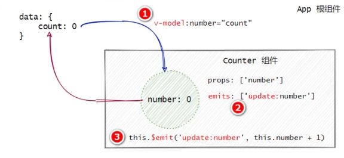
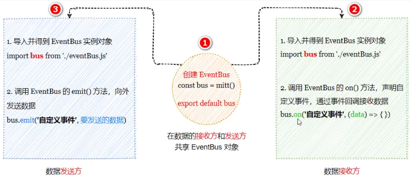
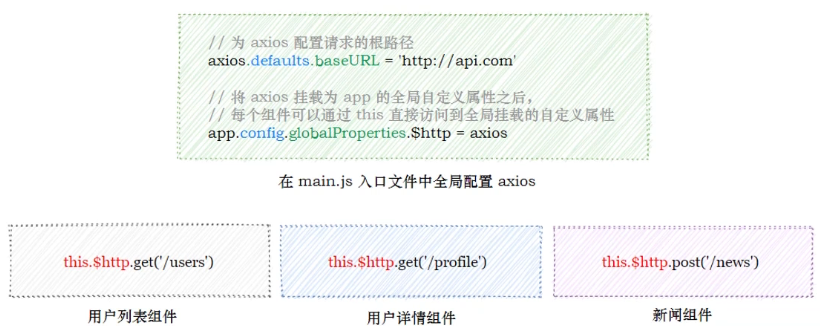

[TOC]


# 一、组件基础

vue官方提供了两种快速创建工程化的 SPA项目的方式:

1.  基于vite 创建SPA项目
2.  基于vue-cli创建SPA项目【==不基于webpack，运行速度快，仅支持vue3.0==】


## 1. vite的基本使用

### 1.1 创建vite项目的步骤：

```
npm create vite@latest  //安装vite包

npm create vite@latest 项目名称 //创建项目
cd 项目名称
npm install
npm run dev
```

### 1.2 项目结构分析

**在项目主目录中**：

- node_modules目录用来存放第三方依赖包
- public是公共的静态资源目录
- src是项目的源代码目录（程序员写的所有代码都要放在此目录下)
- .gitignore是 Git的忽略文件
- index.html是 SPA单页面应用程序中唯一的HTML页面
- package.json是项目的包管理配置文件

**在src文件夹下：**

- assets目录用来存放项目中所有的静态资源文件( css、fonts等)
- components目录用来存放项目中所有的自定义组件
- App.vue是项目的根组件
- style.css是项目的全局样式表文件
- main.js是整个项目的打包入口文件

### 1.3 vite项目的运行流程

在工程化的项目中，vue要做的事情很单纯 : <span style="color:red">通过**main.js** 把 **App.vue**渲染到**index.html**的指定区域中</span>。

其中：

1.  App.vue用来编写待渲染的模板结构
2.  index.html 中需要预留一个el区域
3.  main.js 把 App.vue渲染到了index.html所预留的区域中

### 1.4 基本使用

1、在App.vue中清空并编写模板结构

2、在index.html中预留el区域

3、在main.js中进行渲染

按照vue 3.x的标准用法，把 App.vue 中的模板内容渲染到 index.html页面的el区域中:

```js
// 1．从 vue中按需导入 createApp函数，
//createApp函数的作用:创建vue的“单页面应用程序实例”
import { createApp } from 'vue'

import './style.css'

//2．导入待渲染的 App 组件
import App from './App.vue'

//调用createApp()函数，返回值是“单页面应用程序的实例"，时把 App 组件作为参数传给createApp函数，表示要把 App 渲染到index.html 页面上,调用实例的 mount方法，用来指定 vue 实际要控制的区域
createApp(App).mount('#app')
```


## 2. vue组件的构成

组件化开发∶根据封装的思想，把页面上可重用的部分封装为组件，从而方便项目的开发和维护。

### 2.1 在template中定义根节点

在vue 2.x的版本中，< template>节点内的 DOM结构仅支持**单个根节点**,==因此需要使用< div>进行包裹==，

但是，<span style="color:red">在 vue 3.x的版本中，< template>中支持定义多个根节点</span>:

```html
<template>
  <!-- 这是包含多个根节点的 template结构，因为 h1标签和 h2标签外层没有包裹性质的根元素 -->
  <h1>根节点</h1>
  <h2>vue3</h2>
</template>
```

### 2.2 script节点

**script中的name节点：**

```js
export default {
  // name属性指向的是当前组件的名称（建议:每个单词的首字母大写)
  name:'Myapp'
}
```

在使用vue-devtools进行项目调试的时候，自定义的组件名称可以清晰的区分每个组件:


## 3. props验证

### 3.1 类型检查、必填项、默认值

可以直接为组件的prop属性指定基础的校验类型，从而**防止组件的使用者为其绑定错误类型的数据**，

如果某个prop属性值的类型**不唯一，此时可以通过数组的形式**，为其指定多个可能的类型,:

```js
export default {
props: { //支持的8种基础类型
    propA: String,//字符串类型
    propB: Number,//数字类型
    propC: Boolean,//布尔值类型
    propD: Array,//数组类型
    propE: Object,//对象类型
    propF: Date,//日期类型
    propG: Function,// 函数类型
    propH: Symbol, //符号类型
    propJ:[String,Number], //字符串类型与数字类型
    propK:{
    type:String,//当前属性的值必须是String字符串类型
    required:true,//当前属性的值是:必填项，如采使用者没指定propK属性的值，则在终端进行警告提示
},
    propL:{
     type:String,//当前属性的值必须是String字符串类型
     default:100//如果使用者没有指定值，则propL属性的默认值为100
}
},
}

```

### 3.2 通过validator函数自定义验证函数

在封装组件时，可以为prop属性指定**自定义的验证函数**，从而对prop属性的值进行更加精确的控制:

```js
export default{
    props:{
       // 通过“配置对象"的形式，来定义propD属性的“验证规则"
        propD:{
            //通过 validator函数，这个函数是固定写法，对propD属性的值进行校验，“属性的值"可以通过形参value进行接收
            validator(value){
               //propD属性的值，必须匹配下列字符串中的一个
               //validator函数的返回值为true表示验证通过，false表示验证失败
                return['success','waring','danger'].indexof(value)!==-1
            }
        }
    }
}
```


## 4. 计算属性 computed

计算属性本质上就是一个function函数，它可以**实时监听**data中数据的变化，并 **return一个计算后的新值**，<span style="color:red">通过直接调用这个函数来获取返回值来供组件渲染DOM时使用</span>。

注意：

1.  尽管是方法，但是使用时，直接使用方法名即可，不需要当作方法调用
2.  计算属性必须定义在computed节点中
3.  计算属性必须是一个function函数
4.  计算属性必须有返回值
5.  计算属性必须当做普通属性使用

```js
<p>{{count}}乘以2的值是{{plus}}</p>
---------------------------------
data(){
   return{
       count:1
   }
},
computed:{
    plus(){
        return this.count*2
    }
}

```

### 4.1 计算属性与方法的区别

相对于方法来说，计算属性会缓存计算的结果，**只有计算属性的依赖项发生变化时，才会重新进行运算**。因此计算属性的性能更好:

```js
<p>{{count}}乘以2的值是{{plus()}}</p>
<p>{{count}}乘以2的值是{{plus()}}</p>   //这里会打印两次结果，因为方法被调用了两次
<p>{{count}}乘以2的值是{{plus2}}</p>
<p>{{count}}乘以2的值是{{plus2}}</p>    //这里只会打印一次结果，因为后面一次使用时，数据项并没有改变，于是复用了之前的结果，也代表着计算属性会缓存计算的结果
---------------------------------
data(){
   return{
       count:1
   }
},
computed:{
    plus2(){
        console.log('计算属性被执行了')
        return this.count*2
    }
},
methods:{
     plus(){
        console.log('方法被执行了')
        return this.count*2
    }
}
```


## 5. 自定义事件 emits [子传父]

### 5.1 声明自定义事件

开发者为自定义组件封装的自定义事件，必须事先在==emits==节点中声明，示例代码如下:

```js
export default{
    emits:['change']
}
```

### 5.2 触发自定义事件-$emit()

在emits 节点下声明的自定义事件，可以通过==this.$emit('自定义事件的名称')==方法进行触发，示例代码如下:

```js
<button @click="onBtn">+1<button>
------------------------------------------
export default{
    emits:['change'],
    methods:{
        onBtn(){
            this.$emit('change') //当点击+1按钮时，调用this.$emit()方法，触发自定义的 change事件
        }
    }
}
```

### 5.3 监听自定义组件

在使用自定义的组件时，可以通过==v-on | @== 的形式监听自定义事件。示例代码如下:

```js
<button @click="onBtn">+1<button>
<counter @change="getCount"><counter>
------------------------------------------
export default{
    emits:['change'],
    methods:{
        getCount(){
            console.log( '监听到了count值的变化!')
        }
        onBtn(){
            this.$emit('change') //当点击+1按钮时，调用this.$emit()方法，触发自定义的 change事件
        }
    }
}
```

### 5.4 自定义事件传参

在调用==this.$emit()==方法触发自定义事件时，可以通过==第2个参数==为自定义事件传参，示例代码如

```js
<button @click="onBtn">+1<button>
<counter @change="getCount"><counter>
------------------------------------------
export default{
    data(){
        return{
            count:1
        }
    }
    emits:['change'],
    methods:{
        getCount(){
            console.log( '监听到了count值的变化!')
        }
        onBtn(){
            this.$emit('change',this.count) 
        }
    }
}
```


## 6. 双向绑定 v-model

v-model是双向数据绑定指令，当需要==**维护组件内外数据的同步**==时，可以在组件上使用v-model指令

### 6.1 父向子\子向父传递数据

**父向子传递数据**：

1. 父组件通过v-bind:属性绑定的形式，把数据传递给子组件
2. 子组件中，通过props接收父组件传递过来的数据


**子向父传递数据**：



1.  在v-bind:指令之前添加**v-model**指令
2.  在子组件中声明emits自定义事件，格式为**update:想要更新的数据**
3.  调用**$emit()**触发自定义事件，更新父组件中的数据


# 二、组件高级

## 1. watch侦听器

**watch侦听器允许开发者监视数据的变化，从而针对数据的变化做特定的操作**。例如，监视用户名的变化并发起请求，判断用户名是否可用

### 1.1 侦听器的基本使用

开发者需要在==watch节点==下，定义自己的侦听器。实例代码如下:

```js
export default {
    data() {
        return { uername: '' }
    },
    watch: {
        //监听username的值的变化，
        //形参列表中，第一个值是“变化后的新值"，第二个值是“变化之前的旧值”
        username(newVal,oldval) {
            console.log(newVal，oldVal)},
    },

```

### 1.2 immediate选项

默认情况下，**组件在初次加载完毕后不会调用watch侦听器**。如果想让watch侦听器立即被调用，则需要使用==**对象格式**并添加immediate选项==。实例代码如下:

```js
export default {
    data() {
        return { uername: '' }
    },
    watch: {
        username: { //此时需要使用对象格式
           a(newVal，oldVal){ console.log(newVal，oldVal)},
           immediate:true   
    },
    },
```


### 1.3 侦听对象属性 deep

#### 1.3.1 侦听所有属性

**当watch侦听的是一个对象，如果对象中的属性值发生了变化，则无法被监听到**。此时**需要使用deep选项**，代码示例如下:

```js
export default {
    data() {
        return { info: {uername: ''} }
    },
    watch: {
        info: { 
           a(newVal，oldVal){ console.log(newVal，oldVal)},
           deep:true //需要使用deep选项，否则username值的变化无法被监听到
    },
    },
```

#### 1.3.2 侦听单个属性

```js
export default {
    data() {
        return { info: {
            username: '',
            password:''
        } }
    },
    watch: {
        'info.username': { 
           a(newVal，oldVal){ console.log(newVal，oldVal)},         
    },
    },
```

### 1.4 计算属性与侦听器的区别

计算属性和侦听器侧重的应用场景不同:

计算属性侧重于**监听多个值**的变化，最终计算并**返回一个新值**

侦听器侧重于**监听单个数据**的变化，最终**执行特定的业务处理，不需要有任何返回值**


## 2. 生命周期

### 1. **创建阶段（Creation）**

#### (1) `setup`

- **触发时机**：在组件实例创建之前执行，是 Composition API 的入口。
- **作用**：用于定义响应式数据、计算属性、方法等。
- **注意**：`setup` 中没有 `this`，因为此时组件实例还未创建。

#### (2) `onBeforeMount`

- **触发时机**：在组件挂载到 DOM 之前执行。
- **作用**：可以在此时执行一些初始化操作，但此时 DOM 还未渲染。

#### (3) `onMounted`

- **触发时机**：在组件挂载到 DOM 之后执行。
- **作用**：可以访问 DOM 元素，执行依赖 DOM 的操作（如初始化 Three.js 场景）。

------

### 2. **更新阶段（Update）**

#### (1) `onBeforeUpdate`

- **触发时机**：在组件更新之前执行（数据变化但 DOM 还未重新渲染）。
- **作用**：可以在 DOM 更新前执行一些操作。

#### (2) `onUpdated`

- **触发时机**：在组件更新之后执行（数据变化且 DOM 已经重新渲染）。
- **作用**：可以访问更新后的 DOM，执行依赖新 DOM 的操作。

------

### 3. **卸载阶段（Destruction）**

#### (1) `onBeforeUnmount`

- **触发时机**：在组件卸载之前执行。
- **作用**：可以执行一些清理操作（如解绑事件、取消定时器、释放资源等）。

#### (2) `onUnmounted`

- **触发时机**：在组件卸载之后执行。
- **作用**：可以执行最终的清理操作（如释放内存、销毁 Three.js 场景等）。

------

### 4. **其他生命周期函数**

#### (1) `onErrorCaptured`

- **触发时机**：在捕获到子组件错误时执行。
- **作用**：可以处理子组件的错误，防止错误冒泡到全局。

#### (2) `onRenderTracked`

- **触发时机**：在渲染过程中追踪到响应式依赖时执行（仅开发环境）。
- **作用**：用于调试响应式依赖。

#### (3) `onRenderTriggered`

- **触发时机**：在响应式依赖触发重新渲染时执行（仅开发环境）。
- **作用**：用于调试重新渲染的原因。

------

### 5. **Vue 3 生命周期图示**

以下是 Vue 3 生命周期的执行顺序：


## 3. 组件间的数据共享

==**子传父 | 父传子**==见 [双向绑定](#6. 双向绑定 v-model)。

### 3.1 兄弟组件之间的数据共享

兄弟组件之间实现数据共享的方案是EventBus。可以借助于第三方的==包**mitt**==来创建eventBus对象，从而实现兄弟组件之间的数据共享。示意图如下:




### 3.2 后代关系组件之间的数据共享

后代关系组件之间共享数据，指的是父节点的组件向其子孙组件共享数据。此时组件之间的嵌套关系比较复杂可以使用 **（共享者使用）provide** 和 **（接收者使用）inject** 实现后代关系组件之间的数据共享。【注：**一般情况下provide共享出去的数据不是响应式的**】

#### 3.2.1 父节点通过provide共享数据

父节点的组件可以通过provide方法，对其子孙组件共享数据:

1、**在根组件和父组件中**：

```html
--根组件:
<script setup>
import left from './components/left.vue';
import right from './components/right.vue';
import { ref, provide } from 'vue';

// 创建一个响应式对象
const sharedState = ref({
  message: 'Hello from Ancestor!'
});
 
// 使用 provide 函数来提供这个响应式对象
provide('sharedState', sharedState.value);
-----------------------------------------------------------------

```

2、**在子孙组件中：**

```html
子组件A：
<script setup>
import { useStore } from '../store/user';
import { ref,onMounted  } from "vue";

import { inject } from 'vue';
 
// 使用 inject 函数来注入 sharedState
const sharedState = inject('sharedState');
let userData=useStore();

onMounted(()=>{
   
    userData.setusename("sss");
  
})
</script>

<template>
  <span class="left">{{ userData.usename }}</span>
   <span class="left2">{{ sharedState.message }}</span>
</template>

---
子组件B：
<script setup>

import { ref,onMounted  } from "vue";

import { inject } from 'vue';
 
// 使用 inject 函数来注入 sharedState
const sharedState = inject('sharedState');

const change=()=>{
  sharedState.message="ss"
  console.log("88");
}

</script>

<template>
  <span class="right">{{ sharedState.message }}</span>
  <button @click="change">改变</button>
</template>
```


### 3.3 共享响应式的数据

#### 3.3.1 父节点对外共享响应式的数据

父节点使用provide向下共享数据时，可以结合==computed==函数向下**共享响应式的数据**。示例代码如下:

```js
import {computed} from 'vue' //从vue中按需导入computed函数
export default {
  data() {
    return {
      color: 'red'
    }
  },
  components: {
    father
  },
  provide() {
  // 使用computed 函数，可以把要共享的数据“包装为"响应式的数据
    return {
      color:computed(()=>this.color)
    }
  }
}
```


#### 3.3.2 子孙节点使用响应式的数据

**如果父级节点共享的是响应式的数据，则子孙节点必须以 ==.value== 的形式进行使用**。示例代码如下:

```html
<template>
    <!--响应式的数据，必须以.value的形式进行使用-->
    <h3>son组件 --{{color.value}}</h3>
</template>

<script>
export default {
    inject: ['color']
}
</script>
```

### 3.4 vuex

vuex是终极的组件之间的数据共享方案。在企业级的vue项目开发中，vuex可以让组件之间的数据共享变得高效、清晰、且易于维护。

## 4. vue3中全局配置axios

在开发中，几乎每个组件中都会用到axios 发起数据请求。此时会遇到如下两个问题:

- 每个组件中都需要导入axios(代码臃肿)
- 每次发请求都需要填写完整的请求路径（不利于后期的维护)

### 4.1 全局配置axios

在**main.js**入口文件中，通过<span style="color:red">**app.config.globalProperties**</span> 全局挂载axios，示例代码如下:




## 5. ref引用

ref用来辅助开发者在不依赖于jQuery 的情况下，**获取DOM元素或组件的引用**。

每个==vue的组件实例上，都包含一个$refs对象==，里面存储着对应的DOM元素或组件的引用。**默认情况下，组件的$refs 指向一个空对象**。

### 5.1 使用ref引用DOM元素

```js
<!--使用ref属性，为对应的DOM 添加引用名称-->
<h3 ref="myh3">MyRef 组件</h3>
<button @click="getRef">获取$refs引用</button>

------------------------------------------------
methods: {
    getRef() {
        //通过 this.$refs.引用的名称可以获取到DOM元素的引用
        console.log(this.$refs.myh3)  //此时$refs不再指向一个空对象而是一个有属性myh3的对象
        //操作DOM元素，把文本颜色改为红色
        this.$refs.myh3.style.color = 'red'
    },
}

```


### 5.2 使用ref引用组件实例

```js
<!--使用ref属性，为对应的“组件"添加引用名称-->
<my-counter ref="counterRef"></my-counter>
<button @click="getRef">获取$refs 引用</button>
------------------------------------------
methods: {
    getRef() {
        //通过 this.$refs.引用的名称可以引用组件的实例
        console.log(this.$refs.counterRef)
        //引用到组件的实例之后，就可以调用组件上的 methods方法
        this.$refs.counterRef.add()
    },
}

```


### 5.3 组件是异步更新Dom的

当文本框展示出来之后，希望它立即获得焦点，为其添加ref 引用，并调用原生DOM对象的.focus()方法。

<span style="color:red">但此时会报错Cannot read property 'focus" of undefined,得知调用focus的对象是undefined</span>.

==**原因**==：

​     **Dom的更新是异步更新的**

即：当data中的数据更新以后，vue会异步的更新最新的DOM结构，此时由于DOM结构是异步的进行重新渲染，而当调用 this.$refs.ipt.focus()时，页面并没有重新渲染完成，所以 **ipt** 是 **undefined** ，所以想要执行this.$refs.ipt.focus()必须等到页面渲染完成

```html
<template>
<div>
<input type="text" class="form-control" v-if="inputVisible" ref="ipt"/>
<button type="button" class="btn btn-primary" @click="showInput"  v-else>展示 input输入框</button>
</div>
</template>

<script>
export default {
    data(){
        return{
            inputVisible:false;
        }
    },
    methods:{
        showInput(){
            this.inputVisible=true;
            this.$refs.ipt.focus()
        }
    }

}
</script>

```


### 5.4 this.$nextTick(cb)延迟至DOM重新渲染之后

组件的$nextTick(cb)方法，**会把 cb回调推迟到下一个DOM更新周期之后执行**。通俗的理解是︰等组件的DOM异步地重新渲染完成后，再执行cb回调函数。从而能保证cb回调函数可以操作到最新的DOM元素。

```js
 methods:{
        showInput(){
            this.inputVisible=true;
            this.$nextTick(()=>{
                this.$refs.ipt.focus()
            })            
        }
    }
```


## 6. 动态组件 component

动态组件指的是**动态切换组件的显示与隐藏**。vue提供了一个内置的< component>组件，专门用来实现组件的动态渲染。

1.  < component>是组件的占位符
2.  通过is属性动态指定要渲染的组件名称
3.  < component is="要渲染的组件的名称">< /component>

```js
data() {
    return {
        comName: 'my-dynamic-1' //1．当前要渲染的组件的名称
    }
}
<template>
<!-- 3．点击按钮，动态切换组件的名称-->
<button @click="comName='my-dynamic-1'">组件1</button>
<button @click="comName='my-dynamic-2'">组件2</button>
<! -- 2．通过is属性，动态指定要渲染的组件的名称-->
<component :is="comName"></component>
</template>

```


### 6.1 keep-alive保持动态组件状态

默认情况下，切换动态组件时无法保持组件的状态。此时可以使用vue内置的<keep-alive>组件保持动态组件的状态。示例代码如下:

```html
<keep-alive>
<component :is="comName"></component>
</keep-alive>
```


## 7. 插槽 Slot

### 7.1 后备内容(默认内容)

封装组件时，可以为预留的< slot>插槽提供后备内容（默认内容)。如果组件的使用者没有为插槽提供任何内容，则后备内容会生效。示例代码如下:

```html
<template>
  <p>这是 MyCom1 组件的第1个p标签</p>
  <slot>这是后备内容</slot>
  <p>这是 MyCom1 组件最后一个p标签</p>
</template>
```


### 7.2 具名插槽

如果在封装组件时需要预留多个插槽节点，则需要为每个< slot>插槽指定具体的name名称。这种带**有具体名称的插槽叫做“具名插槽”**。

==注意 : 没有指定name名称的插槽，会有隐含的名称叫做"**default**"==.

示例代码如下:

```html
<template>
  <p>这是 MyCom1 组件的第1个p标签</p>
  <slot name="header">这是后备内容</slot>
  <p>这是 MyCom1 组件最后一个p标签</p>
</template>
```


#### 7.2.1 为指定插槽提供内容  v-slot | #

使用再次使用< template>< /template>包裹想要插入的内容，并使用**< template v-slot="插槽名称">**来为具名插槽指定内容

```HTML
<!--使用组件-->
<template>
    <div>
        <my-article>
            <template v-slot:header>
            <h1>滕王阁序</h1>
            </template>
            
             <template v-slot:footer>
            <h1>底部</h1>
            </template>
        </my-article>
    </div>
<template>
   
```


### 7.3  作用域插槽

在封装组件的过程中，可以为预留的< slot>插槽绑定props 数据，这种**==带有props数据的< slot>叫做“作用域插槽”==**。示例代码如下:

```html
<!--自定义组件-->
<div>
  <h3>这是TEST 组件</h3>
  <slot :info="infomation"></slot>
</div>
-------------------------------------------
<!--使用自定义组件-->
<my-test>
  <template v-slot:default="scope"> //此时scope中就保存了info的数据，
                                    //接收的参数名称随意，一般使用scope
      {{scope}} 
  </template>
</my-test>
```


#### 7.3.1 结构作用域插槽的Props

```html
<!--自定义组件-->
<div>
  <h3>这是TEST 组件</h3>
  <slot :info="infomation" :msg="message"></slot>
</div>
-------------------------------------------
<!--使用自定义组件-->
<my-test>
  <template v-slot:default="{msg}"> //将msg从scope上解构出来并使用      
      {{msg}} 
  </template>
</my-test>
```


## 8. 自定义指令

vue官方提供了v-text、v-for、v-model,y v-if等常用的指令。除此之外**vue允许开发者自定义指令**。

vue中的**自定义指令分为两类**，分别是:

- 私有自定义指令
- 全局自定义指令


### 8.1 私有自定义指令的用法

==**自定义组件在声明时，名字不需要带v- ，但使用时，需要加上**==。

在每个vue组件中，可以在==**directives**==节点下声明私有自定义指令。示例代码如下

```js
<template>
    <h1 v-color>app组件</h1>  //自定义组件在声明时，名字不需要带v- ，但使用时，需要加上
</template>


directives: {
    color: {
//为绑定到的HTML元素设置红色的文字
    bind(el){
//形参中的 el是绑定了此指令的、原生的DOM 对象，且这个形参el是固定写法
        el.style.color = 'red'
    }
  }
}

```


### 8.2 全局自定义指令

全局共享的自定义指令需要在main.js中通过“单页面应用程序的实例对象”进行声明，示例代码如下:

```js
const app = vue.createApp({})
//注册一个全局自定义指令'v-focus'
app.directive( 'focus', {
    //当被绑定的元素插入到DOM中时，自动触发mounted函数
    mounted(el) {
        // Focus the element
        el.focus()
    }
}

```


### 8.3 使用mounted使文本框自动获取焦点

**vue3这里与vue2的区别是项目中使用自定义指令时, 【mounted -> bind 】 【 updated ->update 】**

```js
<template>
    <input type="text" v-focus/>
</template>
//这个对象中有一个属性expression用来保存 v-color=后面的值,如这里的值是"'blue'"


directives: {
   //当被绑定的元素插入到DOM中时，自动触发mounted函数
     mounted(el){
         el.focus() //让被绑定的元素自动获得焦点
     }
}
```

==注意==：

**mounted的触发时机是：被指令绑定到元素渲染到DOM上之后,就会立即触发 mounted**。


### 8.4 updated函数

mounted函数只在元素第一次插入DOM时被调用，当DOM更新时 mounted函数不会被触发。updated函数会在每次DOM更新完成后被调用。示例代码如下:

```javascript
app.directive('focus',{
    mounted(el) { //第一次插入DOM时触发这个函数
        el.focus()
    },
    updated(el){ //每次DOM更新时都会触发updated函数
        el.focus()
    }
)
```


### 8.5 函数简写形式

如果bind和update函数中的逻辑完全相同，则对象格式的自定义指令可以简写成函数格式:

```js
app.directives('focus',(el)=>{
     //在mounted和updated时，会触发相同的业务逻辑
    el.focus()
}): 
```


### 8.6 指令的参数值

在绑定指令时，可以通过**“等号”**的形式为指令绑定**具体的参数值**，示例代码如下:

```js
<!--在使用v-color指令时，可以通过"等号"绑定指令的值-->
<input type="text" v-model.number="count" v-focus v-color="'red'">
<p v-color="'cyan'"> {{count}} </p>

<button @click="count++"> +1 </button>

----------------------------------------------

//自定义v-color指令
app.directive( 'color', (el, binding) => {
    //binding.value就是通过“等号"为指令绑定的值
    el.style.color = binding.value
})

```


## 三、 路由

## 1. 路由基础

### 1.1 前端路由的概念与原理

**什么是路由：**

- 路由（英文: router)就是 **对应关系**。


**spa与前端路由：**

- SPA指的是一个web网站只有唯一的一个HTML页面，所有组件的展示与切换都在这唯一的一个页面内完成。此时，不同组件之间的切换需要通过前端路由来实现。

- 结论:在SPA项目中，不同功能之间的切换，要依赖于前端路由来完成!


**什么是前端路由：**

通俗易懂的概念: **Hash地址**与**组件**之间的对应关系。


### 1.2 前端路由的工作方式

1.  用户点击了页面上的路由链接
2.  导致了URL地址栏中的**Hash值发生了变化**
3.  前端路由**监听了到Hash地址的变化**
4.  前端路由**把当前Hash地址对应的组件渲染都浏览器中**


前端路由：指的是**Hash地址**与**组件之间**的对应关系


### 1.3 vue-router的基本使用

**vue-router**是 vue.js官方给出的路由解决方案。它只能结合vue项目进行使用，能够轻松的管理SPA项目中组件的切换。

vue-router的官方文档地址: https://router.vuejs.org/zh/


#### 9.3.1 4.x版本的使用步骤

1.  在项目中安装vue-router
2.  定义路由组件
3.  声明**路由链接**和**占位符**
4.  创建**路由模块**
5.  **导入并挂载**路由模块


1、安装vue-router：

```js
npm i vue-router@next -S 
```


3、声明**路由链接**和**占位符**：

可以使用**< router-link>**标签来==声明路由链接==，并使用**< router-view>**标签来==声明路由占位符==,这个占位符的作用就是为了呈现哪些通过路由链接匹配到的组件

示例代码如下:

```html
<template>
    <h1>App组件</h1>
    <!--声明路由链接-->
    <router-link to="/home">首页</router-link>&nbsp;
    <router-link to="/movie">电影</router-link>&nbsp;
    <router-link to="/about">关于</router-link>
    
    <!--声明路由占位符-->
    <router-view></router-view>
</template>
```


4、创建**路由模块**：

在项目中创建router.js路由模块，在其中按照如下4个步骤创建并得到路由的实例对象:

1.  从vue-router 中按需导入两个方法
2.  导入需要使用路由控制的组件
3.  创建路由实例对象
4.  向外共享路由实例对象
5.  在main.js中导入并挂载路由模块


从vue-router 中按需导入两个方法：

```js
// 1．从 vue-router中按需导入两个方法
//createRouter方法用于创建路由的实例对象
//createwebHashHistory 用于指定路由的工作模式(hash模式)

import { createRouter，createwebHashHistory } from "vue-router"
```


创建并共享路由实例对象:

```js
//3．创建路由实例对象
const router = createRouter({
    // 3.1 通过 history属性指定路由的工作模式
    history: createwebHashHistory().
    // 3.2 通过routes 数组，指定路由规则
    routes: [
    // path是 hash地址，component是要展示的组件
    { path: '/home' ,component: Home },
    { path: '/movie',component: Movie },
    { path: '/about' , component: About },
    ],
})
export default router
```


在main.js中挂载路由模块

```js
import router from './..../router'
app.use(router)
```


## 2. 路由进阶

### 2.1 路由重定向 redirect

路由重定向指的是:用户在访问地址A的时候，强制用户跳转到地址∈，从而展示特定的组件页面。通过路由规则的**redirect属性**，指定一个新的路由地址，可以很方便地设置路由的重定向:


### 2.2 路由高亮

可以通过如下的两种方式，将激活的路由链接进行高亮显示:

- 使用默认的高亮class类
- 自定义路由高亮的class类

#### 2.2.1 默认的高亮class类

被激活的路由链接，默认会应用一个叫做router-link-active 的类名。开发者可以使用此类名选择器，为激活的路由链接设置高亮的样式:

```css
/*在index.css全局样式表中，重新router-link-active的样式*/
.router-link-active {
    background-color : red;
    color : white;
    font-weight: bold;
}
```


#### 2.2.2 自定义路由高亮的class 类

在创建路由的实例对象时，开发者可以基于**linkActiveClass**属性，自定义路由链接被激活时所应用的类名:

```js
const router = createRouter({
    history: createwebHashHistory().
    //指定被激活的路由链接，会应用router-active这个类名，
    //默认的router-link-active类名会被覆盖掉
    linkActiveclass: 'router-active ',
    routes: [
    { path: '/about' , component: About },
    ],
})
export default router
```


### 2.3 嵌套路由

通过路由实现组件的嵌套展示，叫做嵌套路由。

#### 2.3.1 通过children属性声明子路由规则


```js
const router = createRouter({
  routes: [
    { path: '/home', redirect: Home },
    // about页面的路由规则(父级路由规则)
    {path: '/about',component: About,redirect:'/about/tab1',children: [
        //这里的路径不要加‘/‘,不然默认进入根目录
        { path: 'tab1', component: Tab1 },//访问/about/tab1时，展示 Tab1组件
        { path: 'tab2', component: Tab2 } //访问about/tab2时，展示 Tab2组件
      ]
    }
  ]
})
```


#### 2.3.2 默认子路由

默认子路由：如果 children 数组中，某个路由规则的 **path 值为空字符串**，则这条路由规则，叫做“默认子路由”

```js
//由于默认子路由的原因，可以不使用重定向，因此可以删除redirect:'/about/tab1'，改为：
const router = createRouter({
  routes: [
    { path: '/home', redirect: Home },
    {path: '/about',component: About,children: [
        { path: '', componesnt: Tab1 },//一旦进入/about，就会默认进入此路由
        { path: 'tab2', component: Tab2 }
      ]
    }
  ]
})

//同时，子路由链接中的/tab1也需要删除
<router-link to="/about">tab1</router-link>
<router-link to="/about/tab2">tab2</router-link>
```


## 2.4 动态路由匹配

### 2.4.1 路由参数对象-$route

动态路由 : **把 Hash地址中==可变的部分定义为参数项==**，从而提高路由规则的复用性。

在vue-router中使用<span style="color:red">冒号( : )来定义路由的参数项</span>:

```js
//路由中的动态参数以:进行声明，冒号后面的是动态参数的名称，这个参数的名称不是固定的
//对应出现的需求:在Movie 组件中，希望根据id的值，展示对应电影的详情信息
{ path: "/movie/ : id", component: Movie }

//将以下 3个路由规则，合并成了一个，提高了路由规则的复用性
{ path: "/movie/1", component: Movie }
{ path: "/movie/2", component: Movie }
{ path: "/movie/3", component: Movie }
```


**解决方式：**

在对应的Movie模块中，若是在页面中进入了"/movie/1"，在在Movie组件中打印this，可以在属性==$route==【类型是对象】,中发现对象属性==params：{id:"1"}==【“id”这个名字取决于动态参数取得名字】，因此可以通过<span style="color:red">this.$route.params.</span>id来取得传过来的**动态参数**


### 2.4.2 为路由规则开启props传参

在路由模块中，可以通过如下方式开启props传参：

```js
{ path: "/movie/:mid", component: Movie , props:true}
```

在Movie模块中：

```js
export default {
name :"Movie",
//接收props数据
props: ["mid"],
}
```

此时**mid中保存的值为，对应的id值**


### 2.4.3 query与fullPath

```JS
{ path: "/movie/1?name=zs", component: Movie }
//1. 在hash地址中，如/movie/1中，在 / 后面的参数叫做路径参数
//   在路由“参数对象”中,需要使用this.$route.params来访问路径参数

//2. 在hash地址中,?后面的参数项，叫做“查询参数”
//   在路由“参数对象”中,需要使用this.$route.query来访问查询参数

//3.在this.$route中, path只是路径部分;fullPath是完整的
//  如以上打印结果为/movie/1?name=zs
```


## 2.5 导航(跳转)

- 在浏览器中，**点击链接实现导航的方式，叫做==声明式导航==**。例如:
  - 普通网页中点击< a>链接、vue项目中点击< router-link>都属于声明式导航
- 在浏览器中，**调用API方法实现导航的方式，叫做==编程式导航==**。例如：
  - ·普通网页中调用**location.href** 跳转到新页面的方式，属于编程式导航


### 2.5.1 vue-router编程式导航API[push|replace|go]

vue-router提供了许多编程式导航的API，其中最常用的导航API分别是:

- **this.$router.push('hash地址')**
  - 跳转到指定hash 地址，并==增加==一条历史记录
- **this.$router.replace('hash地址')**
  - 跳转到指定的hash地址，并==替换掉当前==的历史记录
- **this.$router.go(数值n)**
  - 实现导航历史前进、后退	

####  $router.go()

调用this.$router.go()方法，可以在浏览历史中前进和后退。<span style="color:red">如果后退的层数超过上限，则原地不动</span>.

```html
<template>
  <h3>MyMovie组件 --- {{id}}</h3>
  <button @click="goBack">后退</button>
</template>
<script>
export default {
    props: ['id'],
    methods: {
        goBack() { this.$router.go(-1)}//后退到之前的组件页面
    },
}
</script>
```


#### $router.go() 简化用法

在实际开发中，一般只会前进和后退一层页面。因此vue-router提供了如下两个便捷方法：

- **$router.back()**：后退一个页面
- **$router.forward()**：前进一个页面

补充：**在行内使用编程式导航跳转的时候，this 必须要省略**。


### 2.5.2 命名路由

通过name属性为路由规则定义名称的方式，叫做命名路由。示例代码如下:

```js
{
    path: '/movie/:mid',
//使用name属性为当前的路由规则定义一个“名称”
    name: 'mov',
    component:Movie,
    props: true,
}
```

注意:命名路由的name值不能重复，必须保证唯一性!


#### 使用命名路由实现声明式导航

**1、**

为< router-link>标签动态绑定 to属性的值，并通过**name属性**指定要跳转到的路由规则。期间还可以用**params 属性**指定跳转期间要**携带的路由参数**。示例代码如下:

```html
<template>
    <h3>MyHome组件</h3>
    <router-link :to="{ name: 'mov' , params: { id: 3 }}">go to Movie</router-link></template>

<script>
export default {
    name: 'MyHome'
},
</script>

```


**2、**

调用**push函数期间指定一个配置对象**，**name是要跳转到的路由规则**、**params是携带的路由参数**:

```html
<template>
    <h3>MyHome组件</h3>
    <button @click="gotoMovie(3)">go to Movie</button>
</template>


<script>
export default {
    methods: {
        gotoMovie(id) {
            this.$router.push({ name: 'mov' , params: { mid: id }})
     },
   },
},
</script>

```


## 2.6 导航守卫(访问权限)

**导航守卫可以控制路由的访问权限**。示意图如下:


### 2.6.1 全局前置守卫

**每次**发生路由的导航**跳转**时，**都会触发全局前置守卫**。因此，在全局前置守卫中，程序员可以对每个路由进行访问权限的控制:

```js
//创建路由实例对象
const router = createRouter({ ... })
//调用路由实例对象的 beforeEach 方法，即可声明“全局前置守卫”
//每次发生路由导航跳转的时候，都会自动触发fn 这个“回调函数”
router.beforeEach(fn)

```


### 2.6.2 守卫方法的三个形参

只要发生了路由的跳转，必然会触发 beforeEach 指定的 function回调函数

**全局前置守卫**的回调函数中接收3个形参，格式为:

```js
const router = createRouter({ ... })
router.beforeEach((to,from,next)=>{
    //to 是将要访问的路由的信息对象，即将要访问的页面的路由信息
    //from是将要离开的路由的信息对象，即上一个的页面的路由信息
    //next是一个函数，调用next()表示放行，允许这次路由导航
})                              
```

在守卫方法中如果不声明next形参，则默认允许用户访问每一个路由!

在守卫方法中如果声明了next形参，则必须调用,next()函数，否则不允许用户访问任何一个路由!

### 2.6.3 next函数的三种调用方式

当前用户**拥有**后台主页的访问权限，直接放行:**next()**

当前用户**没有**后台主页的访问权限，强制其跳转到登录页面:**next(' /login')**

当前用户**没有**后台主页的访问权限，**不允许跳转到后台主页**: **next(false)**【强制留着当前页面】


### 2.6.4 控制访问权限

```js
router.beforeEach((to,from,next) =>{
    if (to.path == '/main') {
        const token = localStorage.getItem( 'token' )
        if (token) {
            next() //访问的是后台主页，且有 token的值
        } else {
            next('/login') //访问的是后台主页，但是没有 token的值
        }
    }else {
        next() //访问的不是后台主页，直接放行
    }
})

```

## 
